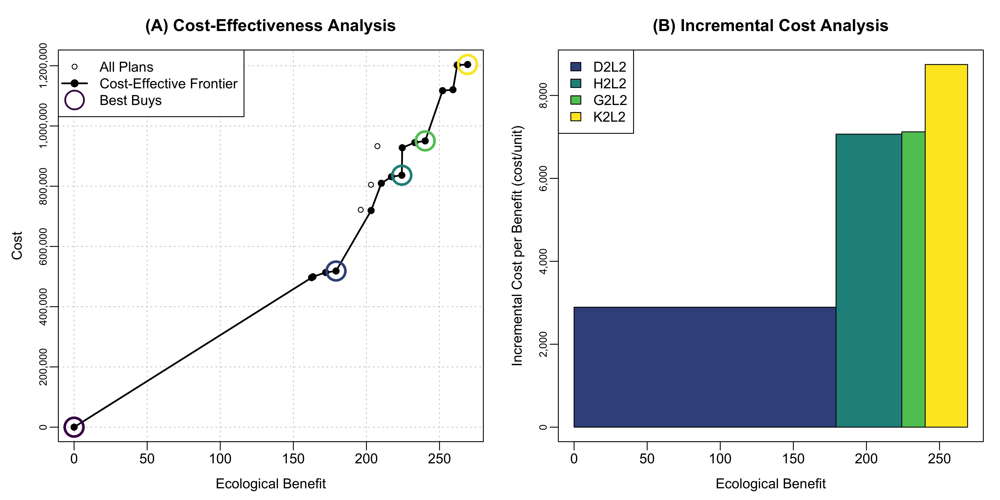

# Cost-Effectiveness and Incremental Cost Analysis (CEICA) with `ecorest` {#ceica-chapter}

***

**This module will teach you how to use the `ecorest` package in `R` to efficiently and reproducibly carry out Cost Effectivness and Incremental Cost Analysis (CEICA) and generate useful output like this in just a few lines of code:**

{width=100%}
  
***
  
*Authors: Ed Stowe (Writing, code), Darixa Hernandez-Abrams (writing, code), Kyle McKay (writing, code). CEICA background information was adapted from a draft tech report on the ecorest R package, authored by Kyle McKay, Darixa Hernández-Abrams, Rachel Nifong, and Todd Swannack*   
*Last update: `r as.Date(file.info('CEICA.Rmd')$mtime)`*  
*Acknowledgements: *
  
## Learning objectives
* Understand the purpose of Cost Effectiveness and Incremental Cost Analysis
* Understand what cost effective and best buy alternatives represent
* Learn how to use the `ecorest` package to determine cost effective and best buy options

## Background on Cost Effectivness and Incremental Cost Analysis

Cost-effectiveness and incremental cost analyses (CEICA) are analytical tools for assessing the relative benefits and costs of ecosystem restoration actions and informing decisions. Benefits and costs are assessed prior to these analyses using ecological models and cost engineering methods, respectively. CEICA may then be conducted at the site scale to compare alternatives at a single location (e.g., no action vs. dam removal vs. fish ladder) or at the system scale to compare relative merits of multiple sites (e.g., no sites vs. Site-A only vs. Site-B only vs. Site-A and Site-B). 

**Cost-effectiveness analysis** provides a mechanism for examining the efficiency of alternative actions. For any given level of investment (i.e., cost), the agency wants to identify the plan with the most return-on-investment (i.e., the most environmental benefits), and for any given level of environmental benefits, the agency wants a plan with the least cost. An “efficiency frontier” identifies all plans that efficiently provide benefits on a per cost basis (i.e., cost-effective plans).  

**Incremental cost analysis** is conducted on the set of cost-effective plans. This technique sequentially compares each plan to all higher cost plans to reveal changes in unit cost as output levels increase and eliminates plans that do not efficiently provide benefits on a per unit cost basis. Specifically, this analysis examines the slope of the cost-effectiveness frontier to isolate how the incremental unit cost ($/unit) increases as the magnitude of environmental benefit increases. Incremental cost analysis is ultimately intended to inform decision-makers about the consequences of increasing unit cost when increasing benefits (i.e., each unit becomes more expensive). Plans emerging from incremental cost analysis efficiently accomplish the objective relative to unit costs and are typically referred to as “best buys”. Importantly, all “best buys” are cost-effective, but all cost-effective plans are not best buys.

## CEICA with `ecorest` in 4 easy steps!

Within the USACE, the Institute of Water Resources has provided a toolkit for conducting CEICA, the IWR Planning Suite (http://www.iwr.usace.army.mil/Missions/Economics/IWR-Planning-Suite/). However, CEICA can also be accomplished swiftly and easily using the `ecorest` package in R, with all the associated benefits that occur when conducting analyses programmatically in R (e.g., reproduciblilty, re-usable scripts, etc.).

Section \@ref(ceica-full) below walks through how CEICA works step-by-step so users can develop a deeper understanding of how CEICA works. But first in this section, we will demonstrate how easy the process is using functions from the `ecorest` package. The following code does everything one needs to determine which alternatives are cost effective and which are 'best buys', and to plot the results. For this demonstration, we will use data from the [Beaver Island Habitat Rehabilitation and Enhancement Project](https://www.mvr.usace.army.mil/about/offices/programs-and-project-management/district-projects/projects/article/1172116/umrr-program-beaver-island-hrep-pool-14/), part of the [Upper Mississippi River Restoration program](https://www.mvr.usace.army.mil/missions/environmental-stewardship/upper-mississippi-river-restoration/). 

First, we load the required packages and the Beaver Island cost-benefit data.
```{r, load-beaver-dat, warning = FALSE, message = FALSE}
library(tidyverse)
library(ecorest)
library(knitr) # Needed to created quality tables
library(scales) # Needed to convert costs to dollars for table generation


# Most basic with Beaver Island
bi_cost_bens <- read_csv("data/beaver_island_cost_ben.csv") 
```

Let's check out the cost-benefit data. To do this, we'll first create a new dataframe that's more suitable for an output table: we can classify the cost figures as being in dollars (using the `scales` package), and rename some of the columns so that they're easier to interpret. Then we'll use the `kable` function from the `knitr` package to view the table. 
```{r tab-orig}
first_table <- bi_cost_bens %>%
  mutate(AnnCost = dollar(AnnCost), # Format as dollars with scales package
         AvgCost = dollar(AvgCost)) %>%  # Format as dollars
  rename("Alt. ID" = AltID,
         "Description" = AltName,
         "Rest. Benefit" = RestBen,
         "Ann. Cost" = AnnCost,
         "Avg. Cost" = AvgCost)

kable(first_table, padding = 2, align = "clccc")
```


To determine which project alternatives are cost effective, the `ecorest` package has a function called `CEfinder`. We can use the `args()` function to determine what inputs are needed for `CEfinder` and any other function.

```{r, args-ce}
args(CEfinder)
```

The inputs consist of 2 vectors: 1) Project benefits; 2) Project annualized costs. We'll make these vectors and then use these in the function.

```{r, calc-ce}
benefits <- bi_cost_bens$RestBen
costs <- bi_cost_bens$AnnCost

restCE <- CEfinder(benefits, costs)
restCE
```

We see that the `restCE` object is a vector of 1s and 0s, with 1s being cost effective options. This indicates that all but three of the options are cost-effective. But we still need to figure out which options are 'best buys.'

To do this, we can use the `BBfinder` function. The inputs are again vectors of benefits and costs, as well as the vector of cost effectiveness scores that we've just created.

```{r, calc-bb}
BB_list <- BBfinder(benefits, costs, restCE)
BB_list
```

The output of the `BB_finder()` function is a list comprised of two dataframes. The first data frame has columns for restoration benefits, costs, and whether alternatives are cost effective and best buys.

The second dataframe features the cost, benefit, and the incremental costs of each best buy compared to the previous best buy (i.e., the slope of the cost effectivness frontier). For example, the third best buy costs *`r scales::dollar(BB_list[[2]][3,2] - BB_list[[2]][2,2])`* more than the second best buy, and yields additional benefits of *`r BB_list[[2]][3,1] - BB_list[[2]][2,1]`* habitat units. By dividing these incremental costs and benefits, we can see that the per-unit incremental cost of best buy three is *`r scales::dollar(round((BB_list[[2]][3,2] - BB_list[[2]][2,2])/(BB_list[[2]][3,1] - BB_list[[2]][2,1]), 2))`*. This is the cost for each additional unit of benefit beyond the second best buy.

Now that we've determined the cost effective and best buy options we can create a table of the output. *Note*: because the BB_list object is a list of two dataframes, we need to extract just the column of 1s and 0s indicating 'best buy' status. To do so, we use the code `BB_list[[1]][,4]`, which pulls the first dataframe in the list (i.e., `[[1]]`), and then the fourth column of that dataframe (i.e., `[,4]`). See [here](https://rpubs.com/tomhopper/brackets) for more information about subsetting with brackets. 

We then create a new dataframe based on the earlier table that we created: we remove the 'Description' column to save space and add two new columns with the cost effectiveness and best buy information.

```{r, beaver-tab}
bb_vector <- BB_list[[1]][,4]

#Create a table of the results
ceica_table <- first_table %>% 
  select(-Description) %>%
  mutate(
    "Cost Effectiveness" = restCE,
    "Best Buy" = bb_vector) 

  kable(ceica_table, padding = 2, align = "lccccc")

```

Finally, we can use the `CEICAplotter` function to create and save plots depicting the results of the cost effectiveness analysis, and the incremental cost analysis. The five required inputs for this function are the project alternative names (which we can pull from our original dataframe using `bi_cost_bens$AltID`), benefits, annualized costs, cost effectiveness scores, best buy scores, and a file name for the plot. The plot will be created in the user's working directory with a filename of their choice.
```{r}
# Create a plot of CEICA results
CEICAplotter(bi_cost_bens$AltID, benefits, costs, restCE, bb_vector, "images/CEICAexample1.jpeg")
```

{width=100%}

And that's it! If a user has cost and benefit data, three functions are all it takes to find cost effective (`CEfinder`) and best buy options (`BBfinder`), and to create a plot of the overall CEICA results (`CEICAplotter`). **And if the underlying cost or benefit data were to change, the R script can instantly update the output with the new data.**

## CEICA in depth {#ceica-full}
We've seen that CEICA can be accomplished very quickly with the above code. However, if a user wishes to understanding how projects are determined to be cost effective or best buys, we go into greater depth here.

### Identifying cost effective alternatives
The first component of CEICA is the cost effectiveness analysis.

Here, for each alternative, we ask: *are there any alternatives that produce higher ecological outcomes for equal or lower costs?*
If the answer is yes, that alternative is considered non-cost effective.

Non-cost effectiveness can be though of in two ways:
* *Inefficient in Production*: any alternative where the same output level can be generated at a lesser cost by another alternative.  
* *Ineffective in Production*: any alternative where a greater output level can be generated at a lesser or equal cost by another alternative.  

Let's look more closely at the cost/benefit data above:
```{r}
bi_cost_bens %>% 
  select(AltID, AnnCost, RestBen) %>% 
  knitr::kable()
```

The first alternative, with a cost of $0, will be considered cost effective, because there are no projects of lesser or equal cost. So let's look at the second option to see if it's cost effective. To do so, we will first see which alternatives have greater benefits, because **if any alternatives have greater benefits at the same or lower cost, then option 2 is not cost effective.**
```{r}
# Vectors defined to make calculations easier
benefits <- bi_cost_bens$RestBen
costs <- bi_cost_bens$AnnCost

# Which projects have greater than or equal benefits than the second project's benefits
greater_bens <- which(benefits >= benefits[2])
greater_bens
```
The `which` function is used to return all the positions (e.g., the first number, the second, and so on) within the `benefit` vector in which the benefits are greater than or equal to the benefits of the second option in the vector (i.e., `benefit[2]`).

Looking at the output, we see that all other projects have greater than or equal benefits than alternative #2.

Now, we're looking to see if there are any projects with equal or greater benefits but for lower costs.

```{r}
which(costs[greater_bens] <= costs[2])
```
A value of 1 indicates that only the cost in the first position (i.e., alternative #2's own cost) is less than or equal. In other words, no alternatives with greater or equal benefits cost less or the same, meaning that this is a *cost effective* option. We stoll don't know though if it is a *best buy*.

Let's look at a different alternative using the same code: Alternative E2L1, which is the sixth alternative:

```{r}
greater_bens <- which(benefits >= benefits[6])

which(costs[greater_bens] <= costs[6])

```

This suggests that another alternative with a greater or equal level of benefits costs less than or the same as E2L1. The index value of 3 (compared to the index value of 1 for E2L1), suggests that it's two projects after E2L1 in the project list: E2L2, which has a lower cost but higher benefit. Therefore, E2L1 will not be considered cost effective.

We could do what we've just done for each project, but that would take time and be tedious. Instead, we can iterate through all the projects by using a 'for-loop', as the following code indicates:

```{r}
# Set up empty vector to store whether each alternative is cost effective
CE <- c()

# Iterate through each project to see if another project renders that one cost ineffective
# An ifelse statement assigns a value of 1 to projects that are cost effective, and 0 to ones that are not
for (i in 1:length(benefits)) {
        bigben <- which(benefits >= benefits[i])
        CE[i] <- ifelse(length(which(costs[bigben] <= costs[i])) == 
            1, 1, 0)
    }

cbind(bi_cost_bens$AltID, CE)
```
For each iteration of the for-loop (i.e., for all values of i from 1 to 19), we run essentially the same code as above. The if-else statement indicates that if the length of the second vector produced above is 1 (as it was with the first alternative above), the project is cost effective and we will assign a value of 1 to the `CE` vector. However, if the length of second vector is not 1 (as it was for alternative E2L1), the project is not cost-effective and we will assign it a 0.

Using the for-loop thus lets us quickly determine which alternatives are cost-effective and which are not.

### Identifying 'best buys'
Identifying best buys is a matter of finding which of the cost effective alternatives can increase environmental benefits at the lowest incremental cost (i.e., lowest cost per additional habitat unit).

The first best buy is always the one with the lowest average cost after 0. 

To find all of the best buys, we can start again with our vectors of benefits and costs, but now we will subset these to include just the cost effective options, and then reorder the benefits and costs from lowest to greatest cost.

```{r}
# Subset to cost effective options
ben.CE <- benefits[which(CE == 1)]
cost.CE <- costs[which(CE == 1)]

# Reorder benefits and costs from lowest to greatest cost
ben.CE2 <- ben.CE[order(cost.CE)] 
cost.CE2 <- cost.CE[order(cost.CE)]
```

All costs and benefits are greater than the first cost effective option (i.e., the $0 cost-0 benefit future without project or FWOP), so we now calculate the incremental costs: this is the difference in costs among subsequent alternatives, divided by the difference in benefits among subsequent alternatives. The `cost.CE2[-1]` and `ben.CE2[-1]` code are the costs and benefits *except for the first item in the list, (i.e., `costCE2[1]`).*
```{r}
inccost <- (cost.CE2[-1] - cost.CE2[1])/(ben.CE2[-1] - ben.CE2[1])
            
inccost %>% dollar()
```

We want to find the lowest incremental cost after the FWOP. Eyeballing the list, we can see it's the fourth cost, but we can also do this using the code. To find the project this corresponds to, we need to add 1 to this value, because the incremental costs above do not include the first project, i.e., the FWOP.
```{r}
which(inccost == min(inccost)) + 1
```

This indicates that the fifth alternative is the second best-buy after the FWOP.

To look for the next best buy, we want to just look at projects after the fifth project. We first generate cost and benefit vectors for the projects after alternative five. And then we calculate incremental costs for projects above the fifth alternative. The values in the bracket `[-1:-5]` indicate to remove the first five values from these vectors.

```{r}
ce.ben.temp <- ben.CE2[-1:-5] # Selects all the project benefits with greater benefits than the current best buy
ce.cost.temp <- cost.CE2[-1:-5] # All the project costs with greater costs than current best buy
inccost <- (ce.cost.temp - cost.CE2[5])/(ce.ben.temp - ben.CE2[5]) # calculate avg. costs from each costlier option compared to the current best buy

inccost %>% dollar()
```

This is our new vector of incremental costs for projects subsequent to the fifth alternative.

Again, we wish to find the lowest incremental cost after this alternative, so we use the same code as previously, except here, we need to add 5 (because we are considering only projects after the fifth alternative)
```{r}  
which(inccost == min(inccost)) + 5
```
This indicates that the 9th option (among the cost effective alternatives) is the next one that is a best buy.

The user could iterate in this way through all the options. But as previously noted, **when iterations are required, this is often a great time to use for-loops**. The following code accomplishes this. Most of this code is nearly identical to what we've already run. The main difference is the use of the `BB` vector to store which alternatives are best buys and to be sure that for each iteration, the new set of alternatives to consider are exclusively the subsequent iterations. Note, at the end of the loop code, there is an `if` statement that ends (i.e., `breaks`) the for-loop if the `BB` vector length is equal or greater than the total number of cost effective options (`nCE`) (i.e., if you get to the end of the vector of projects).

```{r}
BB <- c(1) # Create vector to store BB index positions; the lowest cost option (i.e., position 1 is always a best-buy)
nCE <- length(ben.CE)

for (i in 1:nCE) {
        ce.bentemp <- ben.CE2[-1:-BB[i]] # Selects all the project benefits with greater benefits than the current best buy
        ce.costtemp <- cost.CE2[-1:-BB[i]] # All the project costs with greater costs than current best buy
        inccost <- (ce.costtemp - cost.CE2[BB[i]])/(ce.bentemp - ben.CE2[BB[i]]) # calculate incr. costs from each subsequent option compared to the current best buy
        BB[i + 1] <- which(inccost == min(inccost)) + BB[i] # Of all the incremental costs above this best_buy, which has the lowest?
        if (BB[i + 1] >= nCE) {
            break
        }
    }

BB
```    
This indicates that the best buys are in positions 1, 5, 9, 12, and 16 of the *cost effective* projects, (not the total list of projects). 

To see which projects those are out of our overall list we can run the following code. We start with our original cost-benefit dataframe `bi_cost_bens`, add the cost effectiveness vector `CE` and then filter to just the cost effective options and finally arrange by cost (since we previously sorted in this way when finding the best buys). Our best buys are now just the project alternatives in the rows identified by the `BB` vector (i.e., rows: `r BB`), so we can use the `dplyr::slice()` function to filter to just those rows. Finally we use `pull()` to create a vector of just the alternative IDs that are the best buys.

```{r}
BB_IDs <- bi_cost_bens %>%    # Start with the original data frame
  mutate(cost_eff = CE) %>%   # Add a column of the cost effectiveness scores
  filter(cost_eff == 1) %>%   # Filter to just the cost effective options
  arrange(AnnCost) %>%        # Arrange by cost
  slice(BB) %>%               # Keep rows in the positions identified by BB
  pull(AltID)                 # Pull the alternative names out
  
BB_IDs
```

If we want to view these results in tabular form as we did previously, we can again make a new dataframe with the alternative IDs, the costs and benefits, which options are cost-effective, and which are best buys; and print it using the `kable()` function. To create the `best_buy` column, we use an if-else function that scores the row a 1 if that row's `Alt ID` is in the vector `BB_IDs` and otherwise codes the row as a 0.

```{r}
first_table %>%
  select(-Description) %>%
  mutate("Cost Effective" = CE,
         "Best Buy" = ifelse(`Alt. ID` %in% BB_IDs, 1, 0)) %>%
  knitr::kable(padding = 2, align = "c")

```

## Summary
* Cost-effectiveness analysis provides a mechanism for examining the efficiency of alternatives.  
* Alternatives are cost effective if there aren't any alternatives that produce higher ecological outcomes for ≤ costs
* Not all cost effective options are best buys; these are only the options with the lowest incremental costs compared to the previous best buy
* The `ecorest` package provides a simple and easy set of functions for determining which project alternatives are cost effective and which are best buys and for plotting these results

