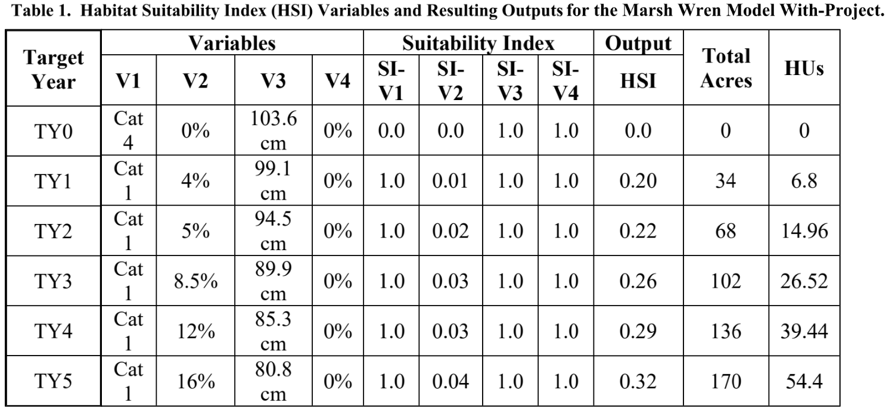
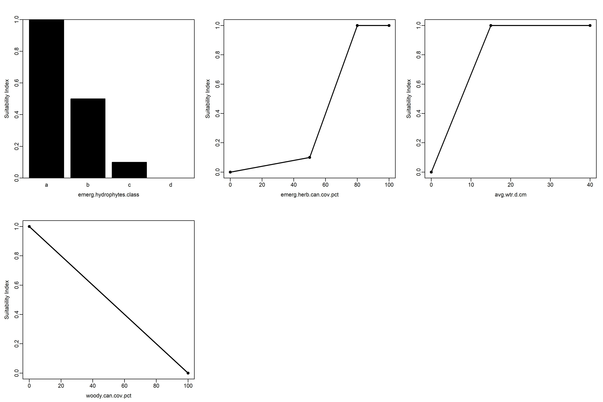
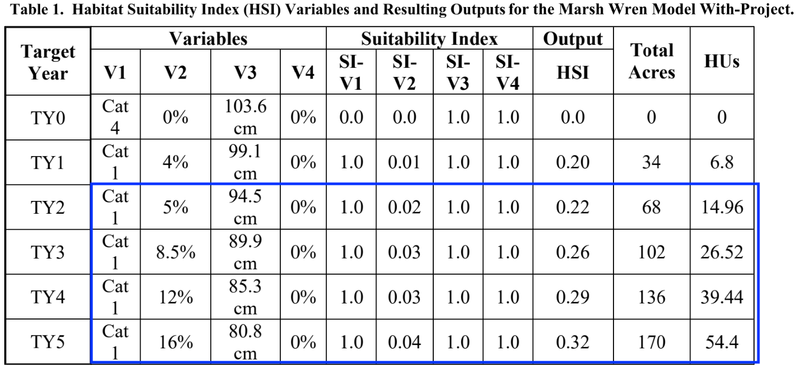

# Habitat Suitability Index models with `ecorest`  

***

**This module will teach you how to use the `ecorest` package in `R` to efficiently and reproducibly carry out HSI modeling and generate useful output like this:**

{width=100%}
  
***
  
*Authors: Darixa Hernandez-Abrams (writing, code), Kyle McKay (writing, code), Ed Stowe (writing, code, editing), ; Background from the draft ecorest tech report, authors: Kyle McKay, Darixa Hernández-Abrams, Rachel Nifong, Todd Swannack*   
*Last update: `r as.Date(file.info('hsi_models_ecorest.Rmd')$mtime)`*  
*Acknowledgements: *
  
## Learning objectives
* Understand the benefits of conducting HSI modeling programmatically with `ecorest`
* Learn how to use `ecorest` to implement `blue book` HSI models
* Build a custom HSI model using `ecorest` 

## Background on HSI modeling with `ecorest`

Before `ecorest`, there was no standard platform for computing outcomes from habitat or other index models. Then and now, users often develop ad hoc spreadsheet models, but these can be highly prone to numerical errors (McKay 2009). The common quantity-quality structure of index models, however, provides an opportunity to develop a consistent, error-checked index modeling calculator adaptable to a variety of applications across USACE. That tool is `ecorest`, which can greatly increase the efficiency of performing habitat modeling as well as decrease the likelihood of computational errors.

The `ecorest` package can be used to quickly apply approximately 350 of the HSI models developed by the U.S. Fish and Wildlife Service in the 1980s, often referred to as the "blue book" models, but is flexible enough to carry out any user-defined HSI model, including models that appear in the literature or custom models developed for specific projects.

In this tutorial, we will demonstrate how the `ecorest` package can be used for two different HSI modeling scenarios, one that relies on a blue book model, and another that uses a custom HSI model.

## Run an HSI analysis with `ecorest` using a blue book model

For this scenario, we will use `ecorest` to carry out a modeling analysis that was originally implemented by the Sacramento District as part of the Delta Islands and Levees Feasibility Study. In this study, the Marsh Wren HSI model was used to examine the ecosystem effects of intertidal marsh restoration. The overall Feasibility Study can be found [here](https://www.spk.usace.army.mil/Portals/12/documents/civil_works/Delta/DeltaStudy/FinalEIS/Delta_FSEIS_%20Nov18_Updated_May19.pdf?ver=oOkiNfBdSLY34I8P2aK82Q%3d%3d), and the appendix with details on the habitat evaluation procedure can be found [here](https://www.spk.usace.army.mil/Portals/12/documents/civil_works/Delta/DeltaStudy/FinalEIS/Appendix-F_Delta-HEP-Report.pdf?ver=2018-09-14-162500-980).  

To conduct the HSI modeling in this scenario, we first need to add the necessary packages to our `R` session.

```{r, warning = FALSE, message = FALSE}
library(ecorest)
library(tidyverse)

```

```{r, include=FALSE}
#Code chunk for scrollable output
options(width = 100)
local({
  hook_output <- knitr::knit_hooks$get('output')
  knitr::knit_hooks$set(output = function(x, options) {
    if (!is.null(options$max.height)) options$attr.output <- c(
      options$attr.output,
      sprintf('style="max-height: %s;"', options$max.height)
    )
    hook_output(x, options)
  })
})
```

The `ecorest` package contains a list object called `HSImodels`. Each of the 349 elements of the list is a dataframe representing one of the U.S. Fish and Wildlife Service's habitat suitability index (HSI) models. Each HSI model consists of multiple independent variables (e.g., percent canopy cover) and their associated habitat suitability values ranging from 0 to 1. Categorical input variables are coded as letters. All models can be called in `R` with the corresponding model name using `HSImodels$modelname` (e.g., `HSImodels$barredowl`).

To look at the HSI models that are available, run the following code:
```{r, max.height = '100px'}
names(HSImodels)

```

Another important object that is contained within the package is the `HSImetadata` dataframe. This contains information on each HSI model, including how the different suitability variables within a model should be aggregated to calculate an overall HSI value for a project alternative. The following code generates a small subset of the variables and rows of this dataframe.

```{r}
HSImetadata %>%
  dplyr::select(model, submodel, Eqtn) %>% # Select which columns to display
  slice(1,4:6) # Select which rows to display
```

### Explore the Marsh Wren HSI model 
To use the Marsh Wren HSI model, we extract it from the `HSImodels` object.
```{r}
wren_hsi <- HSImodels$marshwren
```

Print the Marsh Wren model to the console to look at its structure: 
```{r}
print(wren_hsi)
```
As you can see, `HSImodels` provides a series of suitability curves ordered as parameter breakpoints and associated suitability indices for each parameter.  Each column containing information about an environmental variable (e.g., emerg.hydrophytes.class) is followed by a column (with a name ending in `.SIV`) of suitability index values for the associated environmental predictor.  

The marsh wren HSI model can also be viewed graphically. The `HSIplotter` function creates a JPEG image file in the images folder of your working directory. The user selects the name of the file, but should keep the ".jpg" file extension.
```{r}
HSIplotter(wren_hsi, "images/marshwren_hsi.jpg")
```

If you open the plot file in your working directory, it should look like this:


{width=100%}


### Calculate suitability values from environmental variables  

To calculate the acres of habitat that a project would produce, we need estimates of the environmental variables that make up the chosen HSI model. For the Marsh Wren, these variables include:

* Growth form of emergent hydrophytes
* Canopy cover of emergent herbaceous vegetation
* Mean water depth
* Canopy cover of woody vegetation

Values for these variables can be imported from a .csv file, or can be entered manually as we do below. Here we take values from the row of the table that corresponds with target year 1 (TY1). *Environmental variables must be in the same order as they appear in the HSI model.* Categorical variables, such as emergent hydrophyte growth form, are coded as letters.
```{r}
env_vars <- tibble(v1 = "a",
                   v2 = 4,
                   v3 = 99.1,
                   v4 = 0)

```

In order to calculate habitat units, we also need to provide the project area in acres. Here we provide the area listed for TY1 above.  
```{r}
area = 34
```

Next, we use the `SIcalc` function to calculate the suitability value for each variable in the model. The `SIcalc` function computes suitability indices using two inputs: the suitability model (`wren_hsi`) and the project-specific environmental variables that we've provided (`env_vars`).

```{r}
si_vars <- SIcalc(wren_hsi, unlist(env_vars))
print(si_vars)
```

### Aggregate HSI value and habitat units

A crucial part of HSI modeling is determining how the SI values of our different variables will be combined to create the overarching HSI score. SI values can be combined in numerous ways (e.g., geometric mean, minimum value, etc.). Most blue book models, however, identify a species/submodel-specific way to combine SI values, according to the specific attributes of the species. Therefore, when a blue book model is being used, the `HSIeqtn` function should be used to  calculate the cumulative HSI score using the appropriate equation. This function requires the name of the HSI model, the variables for each of the individual metrics that we've calculated, and the `HSImetadata` file, where the equation is stored.
```{r}
total_HSI <- HSIeqtn("marshwren", si_vars, HSImetadata)
print(total_HSI)
```
Once we have calculated our cumulative HSI score from our separate SI values, we can lastly calculate the **habitat units** associated with the given project.
```{r}
Total_hab <- total_HSI*area
print(Total_hab)
```
  
### Habitat units for multiple years or alternative projects
  
If multiple project alternatives exist, or there are multiple years of environmental data, we can perform the same operations as above using the below code. Here, a for-loop allows us to iterate through each of the scenarios/years to calculate SI values and habitat units
```{r, warning = FALSE}
# Create dataframe of environmental variables for 4 scenarios/years
new_env_vars <- tibble(V1 = rep("a", 4),
                       V2 = c(5, 8.5, 12, 16),
                       V3 = c(94.5, 89.9, 85.3, 80.8),
                       V4 = c(0, 0, 0, 0))

nyears <- nrow(new_env_vars) # Number of years/alternatives
nvars <- ncol(new_env_vars) # Number of environmental variables

new_area = c(68, 102, 136, 170)

# Create an empty matrix and vector to hold the results of the SI and HSI calculations, respectively
new_si_vars <- matrix(0, nrow=nyears, ncol=nvars)
new_total_HSI <- rep(NA, 4)

# Use a for-loop to calculate SI values and HSI scores for each year/scenario
for (i in 1:nyears) {
  new_si_vars[i, ] <- SIcalc(wren_hsi, unlist(new_env_vars[i, ]))
  new_total_HSI[i] <- HSIeqtn("marshwren", new_si_vars[i, ], HSImetadata)
}

# Create a dataframe of the new SI values
new_si_df <- as_tibble(new_si_vars) %>%
  set_names(c("SI_V1","SI_V2","SI_V3","SI_V4"))

# Create an output table with all of the input and output data
output_tab_wren <- new_env_vars %>%
  bind_cols(new_si_df) %>%
  mutate(output_HSI = round(new_total_HSI, 2),
         total_acres = new_area,
         HUs = output_HSI*total_acres)

# Print the table using the knitr package
knitr::kable(output_tab_wren, 
             digits = 2, 
             padding = 2,
             caption = "Table 2. Habitat Suitability Index (HSI) Variables and 
             Resulting Outputs for the Marsh Wren Model With-Project.")

```

As you can see, the results we've generated using the `ecorest` package are identical to the ones in the report:
{width=100%}

The beauty of carrying this out in `R` using a script is that we can change an input value and reproduce all the results in a matter of seconds by re-running the code, instead of having to go through all the steps manually. Plus, the `ecorest` package provides instant access to hundreds of quality-controlled blue book models.

## HSI modeling with custom model

Sometimes, a project will use a custom index model instead of a blue book model to calculate habitat units. For example, for its South San Francisco Bay Shoreline Study, USACE-SPN collaborated with ERDC’s Coastal Ecology and Integrated Ecological Modeling teams to develop a quantitative model for tidal marsh restoration in subsided former baylands. The model is sensitive to multiple restoration measures, including the import of beneficially used material for bathymetry lifts, ecotones and other refuges.

They used the `ecorest` package for their habitat model calculations.

### Explore model and data

Import a .csv of the marsh model, print the names of the variables, and plot the model. *Note: for the plotting function to work, the model must be read in using the base R function `read.csv` instead of the tidyverse function `read_csv`*
```{r}
# Import marsh HSI model
marsh_model<-read.csv("data/SF-TM-HEI_InputData.csv")
print(names(marsh_model))
HSIplotter(marsh_model,"images/marsh_model.jpg")
```
{width=100%}

Next, read in the environmental data associated with the alternative project designs.
```{r}
# Dataset of environmental conditions associated with project alternatives
marsh_alts <- read.csv("data/SF-TM-HEI_FieldData.csv")

print(marsh_alts)

```

### Calculate individual suitability indices 

Again, we will create an empty matrix to store the results and calculate the SI values for each parameter using `SIcalc`.
```{r}
 # Create a dataframe of just environmental variables associated with each alternative
env_marsh <- dplyr::select(marsh_alts, -alt)
nalternatives<-length(marsh_alts$alt) # Number of alternatives

# Create empty matrix to store SI values for each alternative
si_marsh <- matrix(NA, nrow=nalternatives, ncol=4)

# Calculate the SI values for each alternative using a for-loop
for(i in 1:nalternatives) {
  si_marsh[i, ] <- SIcalc(marsh_model, env_marsh[i, ])
}

# Convert matrix of SI values to dataframe and name the columns
si_marsh_df <- as_tibble(si_marsh) %>%
  set_names(paste0("SI_", names(env_marsh)))
```

### Calculate the total HSI score

Here, the analysis team developed a custom formula to combine the different HSI scores:
`Cube root((Tidal connectivity * Marsh Age) * (Ecotone + Refuges)/2)`

In R syntax, that code looks like this
`((((SIV2*SIV1)(SIV4+SIV3)/2))^(1/3)) `

To calculate the cumulative score, we'll use the `mutate` function to create a new column in our dataframe of suitability index values, and calculate the total HSI values from the other columns.
```{r}
# Calculate overall HSI from individual SI values
si_total <- si_marsh_df %>%
  mutate(total_hsi = ((((SI_V4+SI_V3)/2)*(SI_V2*SI_V1))^(1/3)))
```

### Cumulative HSI and habitat units

Next, we'll calculate the habitat units associated with the project, assuming a total project area of 300 acres.
```{r}
# Calculate habitat units by multiplying total HSI by project area (300 acres)
area_marsh <- 300

si_total_hu<-si_total %>%
  mutate(HUs = area_marsh*total_hsi)
```

Finally, we can create an output table with all of the data.
```{r}
output_tab <- bind_cols(marsh_alts, si_total_hu) %>%
  set_names(c("Alternative", "PTR", "MA", "HTR", "E", "PTR-SI", "MA-SI", 
              "HTR-SI", "E-SI", "HSI-Total", "Marsh Units"))

knitr::kable(output_tab, caption="Table 3. SF Salt Marsh HSI Values and Marsh Units.", 
             align="c", 
             digits = 2)
```

### Linking steps using pipes

The last several operations that we conducted above can be done in a single "tidy" way by using the pipe operator `%>%`.

The final line of code checks demonstrates that the two output dataframes are identical. 

```{r}
area_marsh = 300

output_tab_2 <- as_tibble(si_marsh) %>%
  set_names(paste0("SI_", names(env_marsh))) %>%
  mutate(total_hsi = ((((SI_V4+SI_V3)/2)*(SI_V2*SI_V1))^(1/3)),
         HUs = area_marsh*total_hsi) %>%
  bind_cols(marsh_alts,.) %>% # This code is slightly different so that marsh_alts data will come first; the "." symbol indicates everything that has come before this function
  set_names(c("Alternative", "PTR", "MA", "HTR", "E", "PTR-SI", "MA-SI", 
              "HTR-SI", "E-SI", "HSI-Total", "Marsh Units"))

all.equal(output_tab, output_tab_2)
```

## Summary
* `ecorest` represents a flexible, reproducible tool for carrying out habitat modeling in the R environment, with countless advantages over ad-hoc spreadsheet approaches
* The `ecorest` package can instantly utilize ~ 350 USFWS blue book models
* `ecorest` also enables users to quickly implement custom HSI models
* Using `ecorest` for HSI modeling can greatly increase efficiency and decrease the likelihood of errors when implementing habitat models

