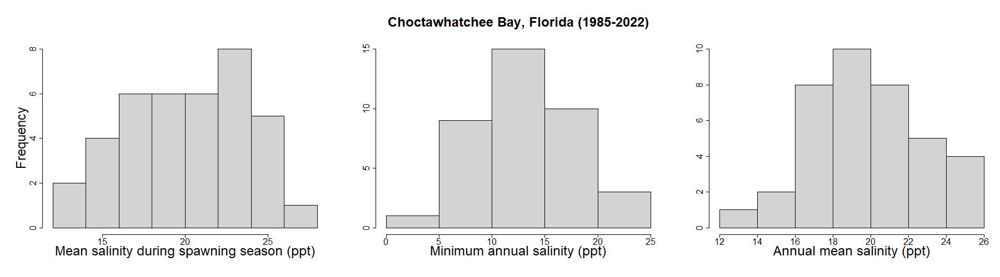

# Sensitivity and uncertainty analysis for habitat suitability index (HSI) models

***

**This module will teach you how to assess the sensitivity and uncertainty of HSI models using the `sensobol` package in `R` .**

{width=100%}
  
***

*Authors: Kiara Cushway, Ed Stowe, Todd Swannack, Kyle McKay*  
*Last update: `r as.Date(file.info('HSI_uncertainty.Rmd')$mtime)`*  
*Acknowledgements: Much of the background information on oyster reefs and the habitat suitability index model used in this module come from Swannack et al. (2014). Information about how to conduct sensitivity and uncertainty analyses using `sensobol` comes from Puy et al. (2022).* 

## Learning objectives

- Understand the benefits of sensitivity and uncertainty analysis for HSI models.
- Learn how to conduct variance-based sensitivity analysis using the `sensobol` package in `R`.

::::::::::::::::::::::::::::::::::::::::::::::::

## Benefits of uncertainty and sensitivity analysis for HSI modeling

Habitat suitability index (HSI) modeling is a widely applied method of habitat evaluation, but its success relies on good data and model frameworks. Various sources of uncertainty can limit the utility of HSI models, which usually represent habitat quality with a single index value and no indication of the confidence in that value (Bender et al. 1996; Burgman et al. 2001). Uncertainty analysis (UA) and sensitivity analysis (SA) can help modelers and practitioners explore and quantify the sources of uncertainty in HSI models (Razavi et al. 2021), providing more confidence in the results and ensuring that models successfully capture ecological relationships observed in the field. UA assesses the confidence we have in a model's results, while SA identifies which model parameters contribute the most uncertainty (Pianosi et al. 2016). 

In this module, we will conduct variance-based global sensitivity and uncertainty analysis for HSI models using the oyster habitat suitability index model (OHSIM) developed by Swannack et al. (2014).


## Variance-based global sensitivity and uncertainty analysis with **`sensobol`**

Variance is a measure of how variable data are. Variance-based UA/SA assess how deviations in the values of model input parameters contribute to variation/uncertainty in HSI scores. To test how much a given parameter influences variance in the output, we can estimate the average variance of a model's output when all but one input parameter in the model is allowed to vary, and that specific parameter is fixed to every possible value across its entire range of uncertainty (Puy et al. 2022).

There are a variety of approaches for conducting sensitivity analyses (see Pianosi et al. 2016 for options). We will use global, all-at-a-time (AAT) methods in this module using the **`sensobol`** package in **`R`**. Global methods test parameter inputs across their entire range of possible values rather than a subset of values. All-at-a-time methods vary all input parameters simultaneously, which enables measurement of interactive effects of parameters on output uncertainty (Pianosi et al. 2016).

The **`sensobol`** package allows users to calculate Sobol' indices, and we will focus on two main indices: 

- *S~i~*: a first-order index that describes how much the variance in the output would decrease if the parameter in question was fixed. 
- *T~i~*: a total order index that describes the first-order effect of a parameter, plus the effect of that parameter interacting with all other parameters in the model (Puy et al. 2022). 

In the remainder of this module, we conduct UA/SA for the OHSIM model using **`sensobol`**.

You will need the **`sensobol`**, **`ecorest`**, and **`tidyverse`** packages for this analysis.

```{r load-packages-uncertainty, message=FALSE, warning=FALSE}
library(sensobol)
library(ecorest)
library(tidyverse)

```

## Habitat suitability modeling for oyster reef restoration

The Eastern Oyster (*Crassostrea virginica*) is a benthic mollusk found in estuarine ecosystems, where it's an important ecosystem engineer and provider of ecosystem services (Grabowski and Peterson 2007; Swannack et al. 2014). Oyster populations are in decline, so several efforts have been implemented to restore oyster reefs in the U.S.

HSI models are used to quantify available oyster habitat and identify areas with high potential for successful restoration (Swannack et al. 2014). To facilitate reef restoration activities, Swannack et al. (2014) developed a spatially explicit oyster habitat suitability index model (OHSIM) that incorporates salinity and substrate variables to assess oyster habitat. These variables include:

1) **Percent cultch**: percentage of a waterbody's bottom composed of hard substrates, which are essential for larval development.

2) **Mean salinity during the spawning season (MSSS)**: average daily salinity from May 1 to Sept. 30, reflecting the need for higher salinity during spawning and larval development.

3) **Minimum annual salinity (MAS)**: minimum annual salinity, which quantifies the effects of freshwater pulses on oyster habitat.

4) **Annual mean salinity (AS)**: average annual salinity, which captures suitable conditions for adult oysters.

The relationship between each of these variables and habitat suitability are described using oyster suitability indices (OSIs). We import oyster suitability curves, and after a little data wrangling, plot them with `ggplot`.

```{r ohsim, message=FALSE, fig.align='center', fig.width=6}

# Bring in data
#load("ohsim.RData")
ohsim <- read.csv("data/ohsim_orig.csv")

# Create data frame of variable names for plotting
ohsim_names <- data.frame(variable = c("AS", "MAS", "MSSS", "PercentCultch"),
                          name = c("Annual mean salinity (AS)",
                          "Mean salinity during spawning season (MSSS)",
                          "Minimum annual salinity (MAS)",
                          "Percent cultch"))

# Pivot oyster dataframe to long format for plotting
ohsim_long <- ohsim %>%
  pivot_longer(cols = everything(),
                 names_to = c("variable", ".value"),
                 names_sep = "_") %>%
  left_join(ohsim_names) %>%      # Join name data frame
  arrange(variable) %>%           # Sort by variable
  drop_na()                       # Remove NA values

ggplot(ohsim_long,
       aes(val, OSI))+
  geom_point()+
  geom_line()+
  facet_wrap(~name, scales = "free")+
  labs(x = "Parameter value", y = "Habitat suitability") +
theme_classic()

```
*Oyster habitat suitability indices (OSIs) based on important habitat parameters for the Eastern Oyster (*Crassostrea virginica*).*

Uncertainty in each of these OSIs contributes to uncertainty in habitat suitability. How much each OSI contributes can be investigated with sensitivity analysis.

### Restoration suitability index

Swannack et al. (2014) combined their OSIs into a restoration suitability index (RSI) using a geometric mean equation, which is calculated by multiplying n numbers together and then taking the nth root (e.g., with three numbers, you multiply the three together and then take the cube root). A typical reason to use a geometric mean is when the modeler believes that if any of the input parameters have a value of zero, the total suitability should also be zero.

We can use the **`HSIgeomean`** function in **`ecorest`** to code a geometric mean. The input of **`HSIgeomean`** will be a vector of OSIs.

### Creating a Sobol' matrix to generate sample data for analysis

The first step in our analysis is to create a sample matrix using the **`sobol_matrices`** function in the **`sensobol`** package. This matrix serves as the basis of our sampling scheme, and should provide sufficient coverage of the entire sampling space, i.e., all the possible combinations of all of the parameters included in our model (Puy et al. 2022). With a larger number of parameters, the number of dimensions making up our sampling space also grows, so more samples are needed to explore possible combinations. A rule of thumb for determining how many samples are required is to use the equation:

<center>

$N = n * (k + 2)$

</center>

where, *N* is the total number of model evaluations, *n* is a base sample size, and *k* is the number of input parameters in the model (Pianosi and Wagener 2015). In the **`sobol_matrices`** function, *N* is automatically calculated when the user enters a base sample size (referred to as **`N`** in the function) and a vector containing the names of our parameters (**`params`** argument). The base sample size selected should be sufficiently large to ensure that the results of your sensitivity analysis converge. One way to determine whether your base sample size is large enough is to test whether the confidence intervals for each of your sensitivity indices are no wider than 0.05 (Sarrazin et al., 2016). We will use a base sample size of 60,000 in our evaluation today, but adjust this if the results of your sensitivity analysis do not converge. These input settings result in a total of 360,000 model evaluations during our analysis.

When creating our sample matrix, we will follow recommendations and generate *A*, *B*, and *A~B~* matrices (Puy et al. 2022). These are the default matrices generated by **`sobol_matrices`** (Puy et al. 2022). Setting **`matrices = c("A", "B", "AB")`** tells the **`sobol_matrices`** function that we want to generate a matrix with *N* rows (in our case, *N* = 360,000), where each row represents a set of OSI values that can be input into our RSI. A total of *n* (in our case, *n* = 60,000) of the rows in this matrix will make up our *A* matrix, and another *n* rows will make up the *B* matrix. The remaining *n* x *k* rows (in our case, 240,000) will make up our *A~B~* matrix, where each individual row of OSI samples will match a row in the *A* matrix, expect for one OSI value (from the *i*-th column) that is drawn from the *B* matrix. We will calculate an RSI value for every row in this sample matrix.

Next, we select the **order** of the effects we are interested in investigating; we will evaluate only first order and total order effects of parameters, although **`sensobol`** is capable of evaluating up to fourth order effects (Puy et al. 2022). 

Finally, to construct our sample matrix, we need to select a sampling scheme. This determines how the total input space is sampled (i.e., how the sample values are selected from all the possible combinations of input parameters). We will use Quasi-random sampling ("QRN"), the default in **`sobol_matrices`** (see Puy et al. 2022 for other options).

The sample matrix we generate here will be used to assess model uncertainty and sensitivity, and to obtain *S~i~* and *T~i~*. To calculate *S~i~*, we will compare RSI values calculated with sets of sampling points that vary with respect to all parameters except one (parameter *x~i~*) (Puy et al. 2022). To calculate *T~i~*, we will compare RSI values for sets of sampling points where all parameters have the same value except parameter *x~i~*, which will vary (Puy et al. 2022).

We set up and preview our sample matrix below:

```{r sobol-matrix, message=FALSE}

# Set seed for repeatability
set.seed(73)

# Define parameter names
params = c("PercentCultch_val", "MSSS_val", "MAS_val", "AS_val")

# Create a sample matrix of probabilities to compute Sobol' indices
sample_matrix = sobol_matrices(matrices = c("A", "B", "AB"), N = 60000, params = params, order = "first", type = "QRN")

# Preview sample matrix
head(sample_matrix)

```

The **`sample_matrix`** now contains a series of model inputs for each OSI that need to be converted into their specific probability distributions. A probability distribution describes how the likelihood of a given outcome changes across the distribution of possible outcomes. For example, in a uniform probability distribution, all parameter values have an equal chance of occurring, whereas in a normal distribution, parameter values are more likely to occur the closer they are to the mean. The probability distribution should depend on knowledge of the parameter. In general, if there is not sufficient information about how an input parameter's uncertainty is distributed, best practice is to use a uniform distribution (Puy et al. 2022). However, the use of a particular probability distribution requires careful consideration, as this choice can affect the outcome of your sensitivity analysis (Puy et al. 2022).

For this analysis, we don't have much information about percent cultch, so we will use a uniform distribution. Estuarine salinity, however, is influenced by semi-predictable or seasonal factors like evaporation and river discharge, so certain values tend to be more common than others. To check this assumption, we'll look at sample data for estuary systems in Florida located near Choctawhatchee Bay, using data from the National Water Quality Monitoring Council's Water Quality Portal (https://www.waterqualitydata.us/) .

{width=100%}
<br>
<br>

Based on these distributions, minimum annual salinity and annual mean salinity follow a somewhat normal distribution, with averages around 13 and 20 ppt, respectively. Mean salinity during spawning season has a flatter distribution, so we'll use a uniform distribution for MSSS, and a normal distribution for MAS and AS. To implement the normal probability distributions, we will use the sample mean and standard deviation with the **`qnorm`** function to inform our sampling scheme. 

Although we want our sensitivity analysis to explore the entire input variability space, we may be less interested in the portion of the input space where an OSI is equal to zero. Furthermore, including these zero ranges in our analysis will result in many of our RSI scores being zero, which presents challenges. Since our sensitivity indices are calculated based on output variance, if most of our outputs are zero (resulting in low variance), it will be hard to detect how our OSI parameters are inducing variance in the model. Given this, for parameters with a uniform distribution, we will define the entire input variability range as the input space where OSI is greater than zero. In other words, for MSSS, we will sample the space where salinity falls between 5 and 40 ppt, rather than sampling across the range presented in the OSI (0-40 ppt).

```{r sample_matrix, message=FALSE}

# For each parameter in the model, use the probability in sample_matrix to obtain a sample value from a probability distribution function
sample_matrix[, "PercentCultch_val"] = qunif(sample_matrix[, "PercentCultch_val"], min = 0, max = 100)
sample_matrix[, "MSSS_val"] = qunif(sample_matrix[, "MSSS_val"], min = 5, max = 40)
sample_matrix[, "MAS_val"] = qnorm(sample_matrix[, "MAS_val"], mean = 13.2, sd = 4.85)
sample_matrix[, "AS_val"] = qnorm(sample_matrix[, "AS_val"], mean = 19.85, sd = 2.88)

```

### Calculating OSI and RSI scores with sample data

Now that our sample data is prepared, we can calculate the OSI score for each parameter in every row of our **`sample_matrix`**. We do this using the **`SIcalc`** function in **`ecorest`**. The **`SIcalc`** function takes a matrix of suitability curves (in our case, **`OSI_curves`**) and uses them to calculate OSI scores for a series of inputs. By applying the **`SIcalc`** function row-wise to our **`sample_matrix`** using a "for-loop," we can obtain OSI scores for all 360,000 sets of our sample data. Note that this step can take some time when running many model evaluations. 

```{r calculate-SI-scores, message=FALSE, eval = FALSE}

# Create empty data frame with the same dimensions as sample_matrix
OSI_scores = data.frame(matrix(NA, nrow = nrow(sample_matrix), ncol = ncol(sample_matrix)))

# Convert sample data to OSI scores for each row of the sample_matrix
for (row in 1:nrow(sample_matrix)) {
  OSI_scores[row,] = SIcalc(SI = ohsim, input.proj = as.numeric(sample_matrix[row,]))
}

```

Finally, using the OSI scores calculated with our **`sample_matrix`** in the last step, we can apply the **`HSIgeomean`** function to each set of sampling points in order to generate an empirical distribution of RSI scores. We will use the variance present in this empirical distribution to understand the distribution of RSI values and interpret how sensitive our RSI model is to changes in input parameters.

```{r calculate-overall-HSI, message=FALSE}

# Load OSI data from previous step
OSI_scores = read.csv("data/OSI_scores.csv")

# Create empty vector to store RSI scores
RSI = vector()

# Calculate geometric mean based on OSI_scores
for (row in 1:nrow(sample_matrix)) {
  RSI[row] = HSIgeomean(OSI_scores[row,])
}

```

### Examining uncertainty in restoration suitability

The vector **`RSI`** now contains the results of all our model evaluations generated with our **`sample_matrix`**. We can examine the distribution of RSI values across the parameter uncertainty using the **`plot_uncertainty`** function in **`sensobol`**, which generates an empirical distribution of RSI scores.

```{r plot-uncertainty, message=FALSE, warning=FALSE}

# Plot uncertainty
plot_uncertainty(Y = RSI, N = 60000) + labs(x = "RSI score")

```

Based on this distribution, RSI scores are spread across the entire possible output range (0-1). 

We can quantify the variability in RSI values in a few ways. For example, we can use the **`quantile`** function to assess the 95% confidence intervals. 

```{r quantiles, message=FALSE}

# Generate quantiles from RSI values
quantile(RSI, probs = c(0.025, 0.975))

```
This suggests the RSI score falls between `r round(quantile(RSI, probs = .025), 2)` and `r round(quantile(RSI, probs = .975), 2)` ninety-five percent of the time.

<br>

We can calculate other typical summary statistics and standard deviation of the empirical distribution of RSI scores as well:

```{r variance, message = FALSE}
# Calculate summary statistics for RSI
summary(RSI)

sd(RSI)

```
Based on these results, across the probability distributions of the OSI values, RSI scores will most commonly fall around 0.5, with 50% of OSI conditions resulting in scores between `r round(summary(RSI), 2)[[2]]` and `r round(summary(RSI), 2)[[5]]`. 

So what does this mean in a USACE modeling or planning context? Well, we want to make sure that our HSI model functions as expected, whether we're designing a new HSI or testing a model in a new location. Here, we allowed the OSI values to vary widely, and included values expected to be poor for oysters. Consequently,  we would expect our overall RSI to also exist across a wide range of suitability values. If it hadn't done this, that might have indicated potential problems with model structure, individual OSIs, or input parameter distributions. And so if an unexpected outcome in the overall HSI occurs at this stage, with either a new model or a model in a new context, that suggests that the model may need to be tweaked.

### Using sensitivity analysis to assess the relative importance of input parameters

We now use sensitivity analysis to understand which model parameters contribute the most to the uncertainty in RSI values. To calculate sensitivity indices with **`sensobol`**, we will use the **`sobol_indices`** function:

We'll use the default settings for most arguments in **`sobol_indices`** (see Puy et al. 2022 for more detailed explanations of settings). In the code below **`Y`** is our vector of RSI scores, **`N`** is the base sample size we specified for our sample matrix, and **`params`** is our list of parameter names. We use **`boot = "TRUE"`** and **`type = "percent"`** to calculate confidence intervals using percents.


```{r calculate-sensitivity-indices, message=FALSE}

# Compute Sobol' sensitivity indices
sensitivity_indices = sobol_indices(matrices = c("A", "B", "AB"), Y = RSI, N = 60000, params = params, first = "saltelli", total = "jansen", order = "first", boot = TRUE, R = 1000, parallel = "no", conf = 0.95, type = "percent")

# View results
sensitivity_indices$si.sum

sensitivity_indices$results %>%
  as.data.frame() %>%
  mutate(across(where(is.numeric), ~round(.x,3)))

# Check the range of the 95% confidence interval
any((sensitivity_indices$results$high.ci - sensitivity_indices$results$low.ci) >= 0.05)

```

Walking through our results, the sum of all of the first-order point estimates is `r round(sensitivity_indices$si.sum, 3)`, meaning that ~`r round(sensitivity_indices$si.sum * 100)`% of the uncertainty in RSI variables can be attributed to the influence of individual parameters. Hence, the OSIs in the model mostly act independently in explaining variance in RSI scores, and interactive effects are small.

The table summarizes the Sobol' *S~i~* and *T~i~* indices, the standard errors, and confidence intervals for each parameter in the model. The range of all our 95% confidence intervals are less than 0.05, which tells us that the sensitivity analysis results converged and we can be fairly confident in our results. These results suggest that the RSI model is most sensitive to mean salinity during spawning season, which accounts for somewhere between `r round(sensitivity_indices$results[2][[4]], 2) * 100` and `r round(sensitivity_indices$results[2][[5]], 2) * 100`% of the uncertainty in RSI values on its own (*S~i~*) and `r round(sensitivity_indices$results[6][[4]], 2) * 100` and `r round(sensitivity_indices$results[6][[5]], 2) * 100`% of the uncertainty in RSI in combination with all other parameters (*T~i~*). Percent cultch contributes the second most to model uncertainty, followed by minimum annual salinity (MAS) and annual mean salinity (AS).

Knowing how different parameters contribute to uncertainty in RSI scores is beneficial for several reasons. It can help you: 

- Prioritize data collection on the parameters that are most influential for habitat suitability.
- Remove unnecessary parameters from a model. 
- Ensure that the structure and function of a model reflects the habitat requirements of a species. 

For example, if a parameter is known to be important for habitat suitability but an HSI model is insensitive to that parameter, it suggests that the model structure does not sufficiently reflect overall suitability.

### Calculating dummy parameters for comparison

How do we know if a given *S~i~* or *T~i~* value actually signifies that a parameter is influencing the model?

To determine this we need a threshold for comparison. We can then consider Sobol' indices below this threshold as not influential on variance in RSI. To do this, we'll calculate a dummy parameter (Korashadi Zadeh et al. 2017; Puy et al. 2022). The dummy parameter is calculated along with our model inputs but is not actually included in the model (Korashadi Zadeh et al. 2017). In the OHSIM sensitivity analysis, we generate 360,000 RSI values using various combinations of our OSI variables. For each combination, we could also randomly pull and store a value between 0 and 1 from a uniform distribution. This value is completely unrelated to the RSI score, meaning that any relationship it has with RSI is pure coincidence (i.e., spurious). What it represents is the numerical approximation error in our model, or the error that arises during our simulation due to rounding or estimation errors (Puy et al. 2022). If a parameter in the model and the dummy parameter have comparable influence on our RSI values, then that model parameter is essentially unimportant within our model as it's formulated.

This code generates values for our dummy parameters (one for *S~i~* and one for *T~i~*):

```{r calculate-dummy-parameter, message=FALSE}

# Calculate dummy parameter
dummy_indices = sobol_dummy(Y = RSI, N = 60000, params = params, boot = TRUE, R = 1000)

# View dummy parameters
dummy_indices %>%
  mutate(across(where(is.numeric), ~round(.x,3)))

```

Interpretation of dummies is similar to that of our Sobol' indices, but values represent noise occurring in the model rather than contributions of actual parameters. Here, between `r round(dummy_indices$low.ci[1], 5) * 100` and `r round(dummy_indices$high.ci[1], 5) * 100`% of the uncertainty in RSI scores for *S~i~* and `r round(dummy_indices$low.ci[2], 5) * 100` and `r round(dummy_indices$high.ci[2], 5) * 100`% for *T~i~* can be attributed to noise in the model. If any of our Sobol' sensitivity indices fall within these ranges, we can say that the RSI model is relatively insensitive to those parameters. Dummy parameters and Sobol’ indices for *S~i~* and *T~i~* are calculated separately, so a parameter could fail to contribute to RSI scores on its own (*S~i~*) but still have important influence through interactions with other parameters (*T~i~*), or vice versa.

For an intuitive summary of the results of our sensitivity analysis, we can use the **`plot`** function to create a bar chart of our results:

```{r graph-sensitivity, message=FALSE, warning=FALSE}

# Plot results of sensitivity index
plot(sensitivity_indices, dummy = dummy_indices)

```

In this plot, bars represent our two Sobol' indices. Horizontal dashed lines represent the upper confidence interval of the dummy parameters for the *S~i~* and *T~i~* indices. If the RSI model were insensitive to any of our OSI variables, the error bars, which represent the 95% confidence intervals of each sensitivity index, would overlap or fall below the dashed lines for both *S~i~* and *T~i~*.

Based on our dummy parameter confidence intervals and the plot, RSI scores are sensitive to all four of the parameters in our model.

Again, this type of analysis can be very beneficial in a USACE context. Planners and biologists creating a new HSI model can use sensitivity analysis to gauge the importance and functioning of different potential parameters. If a model is being applied across a spatially variable region, sensitivity of the model can also be examined in different locations to see if parameter contributions to uncertainty vary among different project locations.

## Summary

- Uncertainty analysis and sensitivity analysis (UA/SA) can greatly improve the utility of HSI models
- UA/SA enable users to explore the magnitude of uncertainty in models, assess the role each parameter is playing in model outcome uncertainty, and determine if models are functioning as expected
- The **`sensobol`** package in **`R`** offers a straightforward UA/SA method using global, all-at-a-time, variance-based analyses

## References


1. Bender, L. C., Roloff, G. J., & Haufler, J. B. (1996). Evaluating confidence intervals for habitat suitability models. Wildlife Society Bulletin (1973-2006), 24(2), 347–352.
2. Brooks, R. P. (1997). Improving habitat suitability index models. Wildlife Society Bulletin (1973-2006), 25(1), 163–167.
3. Burgman, M. A., Breininger, D. R., Duncan, B. W., & Ferson, S. (2001). Setting reliability bounds on habitat suitability indices. Ecological Applications, 11(1), 70–78. https://doi.org/10.1890/1051-0761(2001)011[0070:SRBOHS]2.0.CO;2
4. Grabowski, J. H., & Peterson, C. H. (2007). Restoring oyster reefs to recover ecosystem services. In Theoretical Ecology Series (Vol. 4, pp. 281–298). Elsevier. https://doi.org/10.1016/S1875-306X(07)80017-7
5. Jansen, M. J. W. (1999). Analysis of variance designs for model output. Computer Physics Communications, 117(1–2), 35–43. https://doi.org/10.1016/S0010-4655(98)00154-4
  Pianosi, F., Beven, K., Freer, J., Hall, J. W., Rougier, J., Stephenson, D. B., & Wagener, T. (2016). Sensitivity analysis of environmental models: A systematic review with practical workflow. Environmental Modelling & Software, 79, 214–232. https://doi.org/10.1016/j.envsoft.2016.02.008
6. Pianosi, F., & Wagener, T. (2015). A simple and efficient method for global sensitivity analysis based on cumulative distribution functions. Environmental Modelling & Software, 67, 1–11. https://doi.org/10.1016/j.envsoft.2015.01.004
7. Puy, A., Piano, S. L., Saltelli, A., & Levin, S. A. (2022). sensobol : An R Package to Compute Variance-Based Sensitivity Indices. Journal of Statistical Software, 102(5). https://doi.org/10.18637/jss.v102.i05
8. Razavi, S., Jakeman, A., Saltelli, A., Prieur, C., Iooss, B., Borgonovo, E., Plischke, E., Lo Piano, S., Iwanaga, T., Becker, W., Tarantola, S., Guillaume, J. H. A., Jakeman, J., Gupta, H., Melillo, N., Rabitti, G., Chabridon, V., Duan, Q., Sun, X., … Maier, H. R. (2021). The Future of Sensitivity Analysis: An essential discipline for systems modeling and policy support. Environmental Modelling & Software, 137, 104954. https://doi.org/10.1016/j.envsoft.2020.104954
9. Saltelli, A., Aleksankina, K., Becker, W., Fennell, P., Ferretti, F., Holst, N., Li, S., & Wu, Q. (2019). Why so many published sensitivity analyses are false: A systematic review of sensitivity analysis practices. Environmental Modelling & Software, 114, 29–39. https://doi.org/10.1016/j.envsoft.2019.01.012
10. Saltelli, A., Annoni, P., Azzini, I., Campolongo, F., Ratto, M., & Tarantola, S. (2010). Variance based sensitivity analysis of model output. Design and estimator for the total sensitivity index. Computer Physics Communications, 181(2), 259–270. https://doi.org/10.1016/j.cpc.2009.09.018
11. Sarrazin, F., Pianosi, F., & Wagener, T. (2016). Global sensitivity analysis of environmental models: Convergence and validation. Environmental Modelling & Software, 79, 135–152. https://doi.org/10.1016/j.envsoft.2016.02.005
12. Sobol’, I. M. (1967). On the distribution of points in a cube and the approximate evaluation of integrals. USSR Computational Mathematics and Mathematical Physics, 7(4), 86–112. https://doi.org/10.1016/0041-5553(67)90144-9
13. Sobol’, I. M. (1976). Uniformly distributed sequences with an additional uniform property. USSR Computational Mathematics and Mathematical Physics, 16(5), 236–242. 10. 1016/0041-5553(76)90154-3.
14. Swannack, T. M., Reif, M., & Soniat, T. M. (2014). A Robust, Spatially Explicit Model for Identifying Oyster Restoration Sites: Case Studies on the Atlantic and Gulf Coasts. Journal of Shellfish Research, 33(2), 395–408. https://doi.org/10.2983/035.033.0208
15. Zajac, Z., Stith, B., Bowling, A. C., Langtimm, C. A., & Swain, E. D. (2015). Evaluation of habitat suitability index models by global sensitivity and uncertainty analyses: a case study for submerged aquatic vegetation. Ecology and Evolution, 5(13), 2503–2517. https://doi.org/10.1002/ece3.1520


