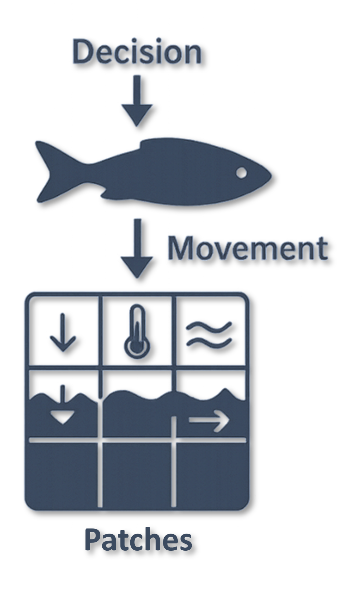
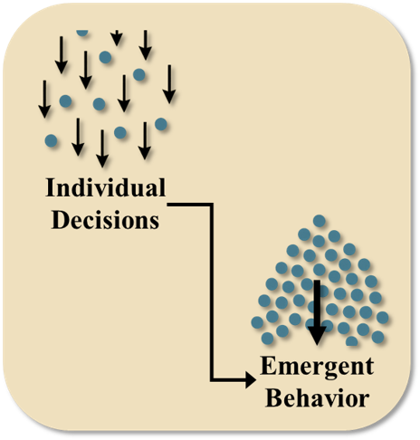

# Agent-based Models

**This module provides an overview of agent-based models and directs users to some example tutorials for agent-based modeling applications related to fish and toxicology.**

***

*Author: Vanessa Mahan*  
*Last update: `r as.Date(file.info('HSI_uncertainty.Rmd')$mtime)`*  

## Overview

Agent-based models (ABMs) simulate the behavior of individual organisms—called “agents”—and how their interactions with each other and with their environment create larger-scale patterns. Each agent follows a set of simple rules based on physiology, behavior, or environmental cues. When many agents follow these rules simultaneously, complex system-level outcomes emerge, such as  pathways, schooling patterns, habitat bottlenecks, or exposure hotspots. ABMs are especially useful for ecological systems because they allow researchers and communities to explore how individual decisions scale up to influence population dynamics, habitat use, and risk in changing environments.

{width=50%}  

ABMs are designed to capture processes that depend on **behavior**, **timing**, **environmental variability**, and **individual differences**. They allow modelers to explore how organisms respond to their surroundings, make movement decisions, and interact with other individuals or species. Because agents experience the environment at fine spatial and temporal scales, ABMs can reveal patterns that occur only when many individuals interact across a dynamic landscape.

## What ABMs Can Help Us Understand

ABMs can answer questions related to:

-   How individual movement decisions accumulate into migration routes or staging locations

-   When and where organisms are most exposed to environmental risks

-   How behaviors such as foraging, schooling, predator avoidance, resting, or spawning influence exposure or survival

-   How variation in traits (size, energy, age, or species) contributes to different outcomes

-   How environmental conditions shape habitat use, movement choices, or interactions between species

-   How system-level patterns emerge from local behaviors and simple rules

-   How alternative conditions or restoration actions might alter movement, habitat use, or exposure

These models are especially useful when management questions depend on **patterns created by individual behavior**, rather than population totals alone.

## What ABMs Are Not Designed to Do

ABMs cannot provide or replace:

-   Exact estimates of population abundance

-   Precise contaminant concentrations inside individual organisms

-   Direct measurements of chemical or physiological processes

-   Predictions of exact numbers of predation or spawning events

-   Large-scale demographic projections without additional modeling components

-   Replacements for field sampling, monitoring programs, or laboratory measurements

Instead, ABMs offer **process-based insight**, showing how behavior and environmental conditions interact to create observable patterns.

## Emergent Behaviors

{width=50%}  

Emergent behavior refers to patterns that arise when many individual agents follow their own rules, creating outcomes that cannot be predicted from observing a single fish on its own. These outcomes develop only when many individuals interact with each other and respond to their surrounding environment at the same time. Many ecological processes such as migration timing, habitat bottlenecks, exposure hotspots, schooling dynamics, predator and prey encounters, and shifts in group structure are emergent rather than linear. They form through small, individual decisions that accumulate into larger and sometimes unexpected system-level patterns.

By visualizing and simulating emergence, ABMs make it possible to see how these individual behaviors scale up to influence population level outcomes and habitat use patterns. This helps identify the specific conditions, behaviors, and locations that shape system-wide responses. For management, this is valuable because it shows how small-scale decisions made by individual fish can contribute to broader patterns that influence risk, habitat quality, restoration effectiveness, management actions, and ecological resilience. Understanding emergence allows managers and communities to explore why certain patterns occur, identify potential leverage points, and anticipate how changes in environmental conditions may alter system behavior in the future.

## Example agent-based modeling framework: GoFish

GoFish is a comprehensive, modular framework for developing and documenting agent-based models (ABMs) that simulate the movement, behavior, and environmental interactions of migratory fish in coastal aquatic systems. It is designed to support the standardization and implementation of ABMs in fisheries management, enabling researchers and practitioners to address complex environmental questions and evaluate remediation or restoration scenarios.

The full library that documents GoFish can be found [here](https://vmahan1998.github.io/GoFish/).

GoFish features several tutorials that explore different levels of model complexity, including:

-   [Schooling and Landward Movement](https://vmahan1998.github.io/GoFish/simple-model-building-tutorial-schooling-landward-movement.html)

-   [Landward Movement, Schooling & Selective Tidal Stream Transport](https://vmahan1998.github.io/GoFish/complex-model-building-tutorial-landward-movement-schooling-selective-tidal-stream-transport.html)

-   [Contaminant Exposure (Mercury in Penobscot River Estuary)](https://vmahan1998.github.io/GoFish/applied-model-building-tutorial-penobscot-mercury-exposure-model-p-mem.html)

Interested readers can may also wish to consider [best agent-based model design practices.](https://vmahan1998.github.io/GoFish/modeling-toolkit.html)

*For questions, feedback, guidance on implementation, or general interest in GoFish or agent-based modeling, please contact **Vanessa Quintana** at [**mahan.vanessa98\@gmail.com**](mailto:mahan.vanessa98@gmail.com){.email}**.**
