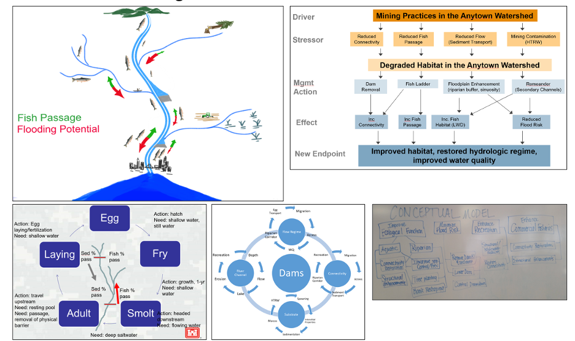
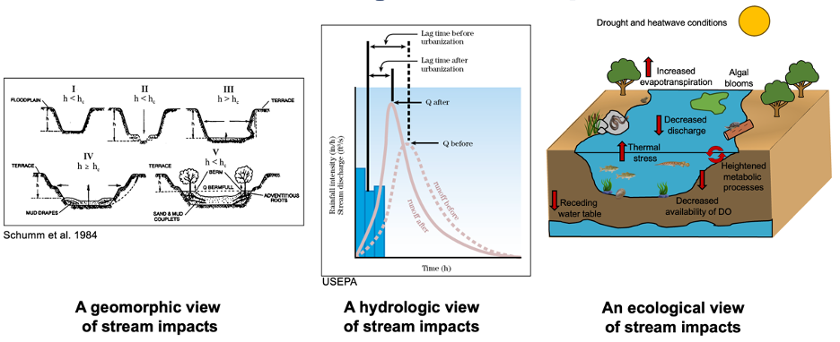
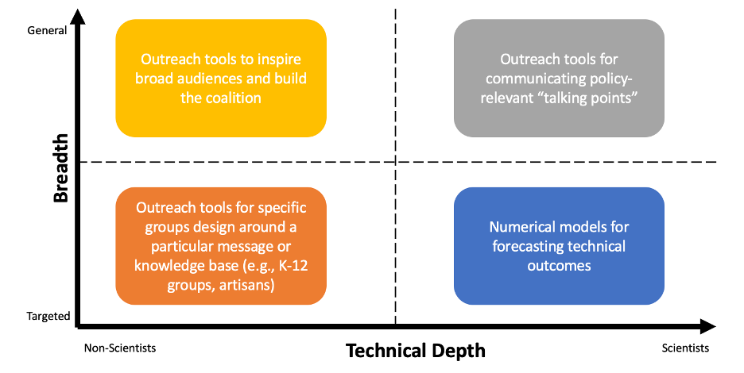
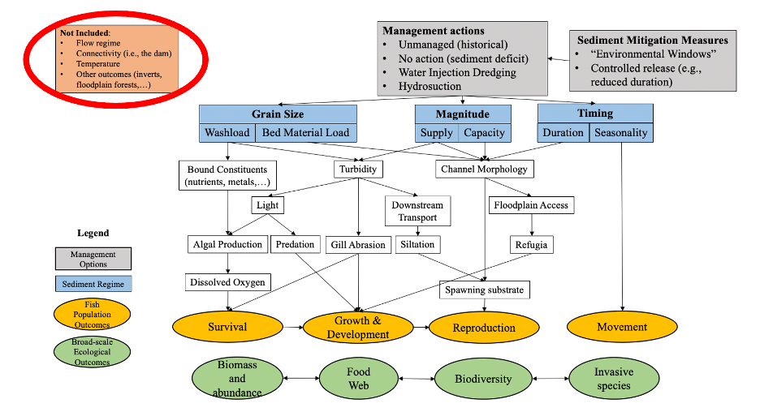
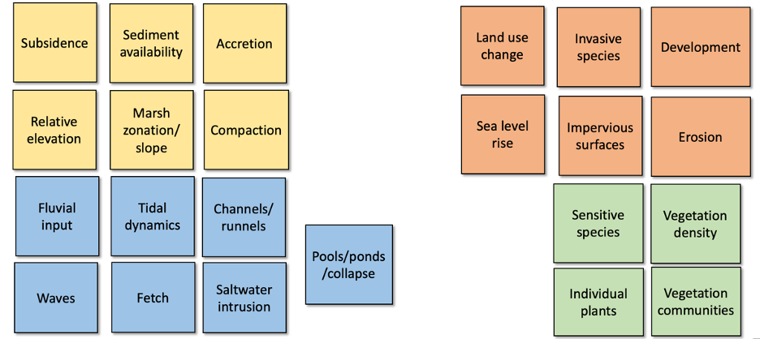
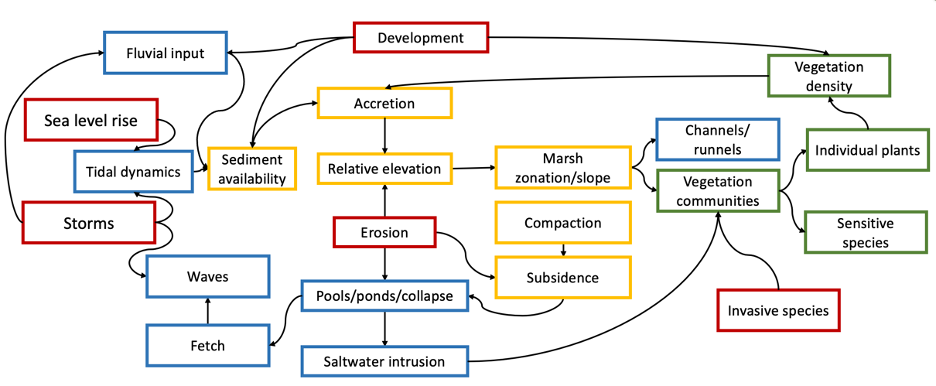

# (PART) Ecological Modeling in R {-} 

# Conceptual Ecological Models

Authors: Todd Swannack, Kyle McKay, Ed Stowe

## Learning objectives  
* Learn what a conceptual model is and is not and what its key functions are  
* Understand how conceptual models can inform ecosystem restoration  
* Understand some of the key steps of developing a conceptual model to inform ecosystem restoration planning  

## Conceptual model background

Conceptual ecological models (hereafter conceptual models) are important tools for planning, designing, implementing, and assessing ecosystem restoration projects. Conceptual models concisely capture and distill the relevant understanding of key elements and dynamics of socioecological systems. They are widely used in environmental planning, risk assessment, and adaptive management, and facilitate communication and collaboration among stakeholders, and identification of restoration opportunities and constraints. The development of a conceptual model often represents a key early step in the planning of ecosystem restoration. In this module, we describe and demystify conceptual models and their development. 

### What is a conceptual model?
A conceptual model is a tentative description of a system or sub-system that serves as a basis for intellectual organization. A conceptual model typically features both the structural elements of a system (e.g., migratory fish), but also the key ecosystem processes that link the components (e.g., predation of fish on macroinvertebrates).

{width=70%}  

### What does a conceptual model do?

Conceptual models describe general functional relationships among essential ecosystem components. Crucially, they tell the story of “how the system works.” Understanding how the system functions is a key step towards understanding elements or processes in the system that restoration can seek to repair or recover. For example understanding that depth is of key importance to lentic fishes in Upper Mississippi River backwaters might spur restoration of deep-water habitat.

{width=40%} 

### How are conceptual models used in ecosystem restoration?
Conceptual models are used in several key ways in ecosystem restoration projects.

Restoration projects often entail collaboration among interdisciplinary teams with different backgrounds. So, a critical purpose of conceptual models is to develop a shared understanding, accomplished via:

* Synthesis of different perspectives  
* Team building  
* Communication  
* Compilation of collective knowledge  

Conceptual models are qualitative in nature, but creating one sets the stage for numerical models that will eventually be used in cost-benefit analysis, accomplished by:  

* Identifying important variables  
* Describing critical processes  
* Articulating flow of logic  
* Defining key data gaps  

A conceptual models can also help inform restoration decisions in several key ways, by:  

* Diagnosing problems  
* Guiding restoration actions  
* Identifying key decision metrics  
* Informing monitoring plans  

### Conceptual models come in different forms

There is no prescribed way of making a conceptual model. The form that one takes will depend on what processes or functions it is designed to inform, the skills and knowledge represented by its developers, the model’s ultimate use, and crucially, the audience it is being created for. Some forms that conceptual models can take include:  

* Narrative  
* Map  
* Picture and Diagrams  
* Box and Arrow Models  

{width=80%} 

 
One system can have many different models, designed for different purposes or audiences, or reflecting different viewpoints. For example, conceptual models on human impacts on streams may look very different depending on whether the hydrology, geomorphology, or ecology is being considered.

{width=80%} 

 
And different audiences may need different models. The technical depth of the audience and the breadth of the material covered by the model will prescribe the creation of very different model types.

{width=80%} 

### What conceptual models are not
In order to describe conceptual models, it’s crucial to understand that they are NOT:  

1.	The truth – instead, conceptual models are simplified depictions of reality  
2.	Comprehensive – they focus only upon parts of an ecosystem deemed relevant while ignoring other important (but not immediately germane) elements
3.	Final – they provide a flexible framework that evolves as understanding of the ecosystem increases  

 The following misconceptions also need to be debunked:  
 
1.	A model cannot be built with incomplete understanding.  
* FALSE: Incomplete information is the norm in environmental management!  
2.	A model must be as detailed and realistic as possible.  
* FALSE: “Lean” models are often the most elegant. Remember Einstein’s aphorism…As simple as possible, but no simpler!  

### How to make a conceptual model
A few key concepts help facilitate the creation of conceptual models.

#### The “art” of conceptual modeling is iterating
Ecosystems are complex. Distilling them to the essential elements and processes for a given application is therefore difficult, and an iterative process of refining the model can greatly help with the development process. The key iteration steps include:  

* Editing  
* Revising  
* Omitting  

In some ways, omitting is the most important, for the sake of the utility and interpretability of the model. Model developers may be wise to remember the (heavily paraphrased) Einstein quote that models “should be made as simple as possible, but no simpler.”

Figure 6
{width=80%} 

#### Think of conceptual modeling as storytelling to guide model building process
A key use of conceptual models is for crystalizing the narrative that will be used for restoration projects. Therefore, thinking of the conceptual modeling process as an act of storytelling can be very effective. The key storytelling questions to ask during the development process are:

* What audience are you trying to reach?  
* What is the setting of your story?  
* Who are the “characters?”  
* What is the plot?  

## Example conceptual model exercise
To understand conceptual model development in practice, here we provide an example of how ecosystem planners and biologists can build a conceptual model to inform restoration or management decisions. This example uses the “storytelling” framework to organize the model development process, and highlights the key steps of creating a conceptual model that can be used for saltmarsh management.

#### Step 1: Define the setting
The Nature Conservancy would like to create a conceptual model outlining important aspects of marsh management. The setting is thus defined as coastal salt marsh habitat. Depending on the desired geographical reach of the model, different levels of specificity may be added to the description of the setting. 

#### Step 2: What story did they want to tell about marsh management?
Answering a few questions about marsh management help the developers key in on the type of model that will be most useful to them.

*What aspects of restoration are you focusing on?*
{width=80%} 

*What should the conceptual model seek to do?*
{width=80%} 

*Who is the target audience for the conceptual model?*
{width=80%} 

#### Step 3: What are the characters in your story?

To start building the conceptual model, it can be helpful to start by identifying all the ecosystem components that may be relevant to the model. Any potentially important elements should be added at this stage. They can be removed later (and many will). Color coding by category (e.g., biochemistry, geomorphology, biology, etc.) can be helpful at this stage. 

{width=80%} 

 
**Step 3 continued:** Refine and organize your cast.
After including all potential components, ecosystem elements can be organized into relevant configurations. Elements that are deemed not essential can be removed at this stage.

{width=80%} 

#### Step 4: What is the plot of your story?

Finally, with all key elements identified, key linkages can be added to capture the essential relationships within the ecosystem. Model developers might explicitly depict how restoration measures should affect the ecosystem, but in some cases, it may be enough to simply include ecosystem elements (e.g., water depth) that may be manipulated by restoration. Remember the diagram you see here does not happen instantly but is instead the result of extensive iteration and collaboration among model developers and diverse subject matter experts.

{width=80%} 

## Summary

* Conceptual ecological models can be an important early step in restoration planning.    
* Models help users organize and synthesize believes about the key processes with an ecosystem, and how restoration may alter those elements.  
* Every conceptual model will be different, tailored to the needs, backgrounds, and objectives of its developers. An iterative process can help model developers arrive at the best model for their particular application.  

## References
Kemp, Michael W., Batleson, R., Bergstrom, P., Carter, V., Gallegos, C.L., Hunley, W., Karrh, L., Koch, E.W., Landwehr, J.M., Moore, K.A. and Murray, L., 2004. Habitat requirements for submerged aquatic vegetation in Chesapeake Bay: Water quality, light regime, and physical-chemical factors. Estuaries, 27(3), pp.363-377.

