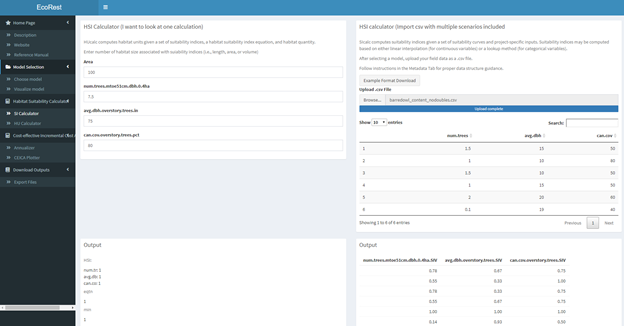

# Ecorest Web App

## Background

In the previous module, we learned how to build HSI models in R using the `ecorest` package. However, there is also a webapp for using the `ecorest` package, and in this tutorial, users can learn how to use this webapp.

The ecosrest webapp combines HSI and CEICA capabilities, package in [ecorest](https://cran.r-project.org/web/packages/ecorest/index.html), under a single graphical user interface. Users can access ecosrest data and functions without the need to use the R programming language. Below are the instructions on how to conduct HSI and CEICA using the *ecorest* webapp.

## **Model Selection**
The first step to conduct a Habitat Suitability Index analysis is selecting the appropriate model(s) for your study. The **Model Selection** tab includes the subtabs *Choose model* and *Visualize model*.

### **Choose Model**

This section allows the user to select a model from either existing USFWS HSI "Bluebook Model" (left panel) or a "User-Specified Model" (right panel).

#### Bluebook model (left panel):
1. Under "Bluebook Model", click the dropdown button and select the model of your choice.

#### User-specified model (right panel):
1. Check the box on the upper-right side to indicate a user specified model will be used.
2. Download the example file for guidance on metadata formatting.
      * The metadata should include information on the model and variable names used (SIVs).
      * Headers for your metadata belong in the first row, starting in the first                      column
        -	Variables with headers but no values are ignored
        -	Variables with no headers but no values are not allowed
        -	Omitting all but the model name is allowed
      * Information on the model belongs in the second row below denoted                             columns.
        - If information is not available one or more of your metadata (e.g.,                           submodel),leave the cells under the header empty. 
      * Insert variable names under SIV headers and end names with ".SIV". 
      * If your model has more suitability curves than the example, add headers as "SIV4",                "SIV5",etc.
3. Upload the metadata as a .csv file in the first upload box.     
4. Download the example file for guidance on model formatting.
      * Headers for your model variables belong in the first row, starting in the first              column.
      * The first column header should be the same as the SIV1 variable name in metadata except for the ".SIV" ending. 
        - Field data for your first model variable (SIV) goes under the rows in this header/column. 
        - These values may be numeric (e.g., 1, 2, 3) or categorical (e.g., a,b,c).
      * The second column header should be the same name as SIV1 including the ".SIV" ending.
        - Suitable index values (SIVs) for your first model variable (SIV1) go in the cells under this header/column.
        - These values must be a numeric value from 0-1. 
      * Repeat this with all other SIVs (e.g., your.variable.name goes first, your.variable.name.SIV goes second)
      * For each model variable, the number of populated rows within a its field data pair must match the number of populated rows in the its suitable index column. In other words, every field data point must have a suitable index value associated to it.
      * Rows and columns of values must be continuous throughout the file.
5. Upload the user-specified model as a .csv file in the second upload box.

### **Visualize Model**

This section allows the user to verify the metadata and suitability plots of their chosen model. Once your model has been selected from available USFWS bluebook models or uploaded (user-specified), the metadata and suitability plots will appear as shown below.

*	The upper box prints out the metadata for the chosen model while the lower box visualizes the suitability indices for each model variable.
*	The metadata can be downloaded in the **Download Outputs** section which is discussed towards the end. The produced suitability plots can be downloaded by right-clicking the plots and selecting the “copy” or “save” option. 
*	If any issues arise in this tab, verify that your uploaded metadata and model data are configured according to the input file formatting. See the "Choose Model"section in this reference guide for formatting information. 

## **Habitat Suitability Calculator**
After choosing a model, the second step in conducting a HSI analysis is selecting an equation and entering your data to compute the patch quantity (Habitat Unit; HU) and quality.
### **Manual input**
This subtab calculates HSI using inputs provided by the user which can be either a single scenario (left panel) or multiple scenarios (right panel). For multiple scenarios, each scenario should be entered in separate rows. Examples of multiple scenarios could be multiple project sites or habitat patches.  

#### Single scenario (left panel):                                                     
1. Enter habitat patch size (numeric) associated with patch quality in the project area.
2. Select your appropriate HSI function. For bluebook models, select 'HSIeqtn'.
3. Enter numeric or categorical values (e.g., a, b, c) under each variable
    *	Do not add units to the inputs
    *	Each suitability index variable will appear with its own input box. 
    * Insert numeric or categorical values into each box accordingly. 
    *	All HSI outputs are visible on the bottom left.

#### Multiple scenario (right panel):
1. Select your HSI function. 
2. Under 'Compiler', select 'Edit' to enter data in table. 
3. Double click cells on table to enter data. 
4. Enter a different scenario per row
   - Leave last row(s) empty if less than 10 scenarios
   - If you have more than 10 scenarios, use the *CSV Input* subtab
5. Click 'Calculate' to view outputs.

### **CSV input**
This tab allows the user to insert data via .csv file to process multiple scenarios at one without the need to use the 'Manual Input'.

#### HSI calculator (left panel):
This panel allows the user computes HSI quality for multiple scenarios by uploading a .csv file with field data. 
1. Download example format for .csv file.
2.	Upload a .csv file containing field data in the file upload box
    *	File formatting conventions for this file include:
      - Headers must start in 1st row and column
      - The header names must match model variable name
      - IMPORTANT For bluebook models, names must match the variable names listed on the             'Manual Input tab on the  left panel.
      - Bluebook models with 'NA' headers...
      - Field data starts in the second row of each populated column
      - Categorical bluebook models must have appropriate letter to match suitability in             lowercase (e.g., a,b,c)
      -	Rows and columns of field data must be contiguous throughout. No empty rows or               columnes in between. Except for ones with NAs?
      -	Must be a comma delimited file extension (.csv)
    * HSI outputs are visible on the bottom right

#### HU Calculator (right panel):
This panel computes habitat units given information on habitat quantity (area) for multiple scenarios. (Requires HSU multiple scenario to be completed!)

1.	Enter a numeric value for the area
    *	Do not add units to the numeric inputs
2.	Select a function
    *	Show all – Requires vector of weights
    *	HSIarimean – No further input required
    *	HSIgeomean – No further input required 
    *	HSImin – No further input required 
    *	HSIwarimean  –  Requires vector of weights
3.	Upload a .csv file containing a vector of weights in the file upload box if required
    *	A file containing an example of the formatting for the field data can be downloaded in this tab
    *	File formatting conventions for the vector of weights file include:
        -	Labels belong in the first row, starting in the first column
        -	Weighted values belong below their denoted columns as 0 or 1
        -	The number of populated rows between every column must be equivalent
        -	Rows of weighted values must be contiguous throughout the column
        -	Must be a comma delimited file extension (.csv)
        -	HU outputs are visible on the bottom 

## **Cost-effective Incremental Cost Analysis**

### **Annualizer**

This section computes time-averaged quantities based on linear interpolation.

1.	Upload a .csv file containing a numeric vector of time intervals in the first file upload box (timevec) and a .csv file containing a numeric vector of values to be interpolated in the second upload box (benefits)
    *	A file containing an example of the formatting for the input files can be found above each upload box
    *	File formatting conventions for the vector of values file and vector of time intervals file include:
        -	Contains a single column 
        -	Label belongs in first cell
        -	Values must be in numeric
        -	Column of values must be contiguous throughout 
        -	Both files must contain equivalent populated row counts
            -Must be a comma delimited file extension (.csv)
2.	A single time averaged quantity will appear below
    *	This value may be extracted by highlighting the value with the cursor, right clicking, and selecting copy

### **Annualizer**

This section computes and plots the Cost-effective Incremental Cost Analysis.

1.	Upload a .csv file containing Cost-effective incremental Cost Analysis (CEICA) data in the file drop location below. 
    *	A file containing an example of the formatting for the input files can be found above each upload box
    *	File formatting conventions for the vector of values file and vector of time intervals file include:
    *	Contains three columns, starting in the first cell 
    *	Label belongs in the first row in this order: altnames, benefit, cost
    *	Altnames values are in string
    *	Benefit and cost values must be in numeric
    *	Column and row of values must be contiguous 
    *	Each row must contain equivalent populated row counts
    *	Must be a comma delimited file extension (.csv)
2.	Two plots will appear, a cost-effective analysis to the bottom left, and a incremental cost analysis to the bottom right
    *	These plots can be downloaded by right-clicking the plots and selecting the “copy” or “save” option.

## **Download Outputs**

### **Export Files**

This section allows the user to download the metadata, SI, and HU results as a .csv file. These files can be compiled into a single file downloadable file with the “Generate Report” button. 

## References

Robinson R. Hansen W., and Orth K. 1995. Evaluation of environmental investments procedures manual interim: Cost effectiveness and incremental cost analyses. IWR Report 95-R-1. Institute for Water Resources, U.S. Army Corps of Engineers, Alexandria, Virginia.

USFW 1991