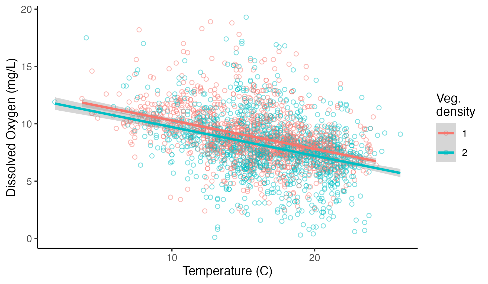

# (PART) Linear Models for informing planning HSIs {-} 

# Linear Models

**This module will teach you how to use linear models in R to assess relationships among environmental factors in the USACE-managed Upper Mississippi River.**

{width=100%}  

*Authors: Ed Stowe*  
*Last update: `r as.Date(file.info('linear_models.Rmd')$mtime)`*  
*Acknowledgements: Some inspiration/language/code have been used or adapted with permission from: Ben Staton's [Intro to R for Natural Resources course](https://bstaton1.github.io/au-r-workshop/ch3.html#lm) and Quebec Center for biodiversity Science's [Linear model workshop](https://r.qcbs.ca/workshop04/book-en/index.html)*


## Learning objectives
* Understand the purpose and structure of a linear model
* Run a linear model in R
* Interpret the output of a linear model
* Assess linear model validity

## Relevance of linear models to USACE 
Linear models and their offshoots estimate the relationship between a response variable and one or more predictor variables. These models are used widely by ecologists to understand, for example, which environmental or management factors are important for determining biological outcomes or phenomena. Linear models have several potential applications to USACE projects and ecological modeling practices, including:  

* Validating and updating relationships within existing HSI models
* Creating new habitat models that are based on empirical data instead of conjecture
* Estimating the relationship between focal taxa and habitat characteristics in order to predict the response of these species to USACE habitat-altering projects (thus potentially acting as an alternative to a habitat model)

## Background on linear models

Linear models are used to estimate the relationship (if any) between a response variable and one or more predictor variable(s). They are typically constructed to analyze an *a priori* hypothesis about how variables are correlated. The results of the analysis indicate the direction and strength of the relationship between the variables, and what level of confidence we have in this relationship. 

### Linear model formulation

In a linear model, the response variable is the variable that we wish to explain, and is also known as the dependent variable, because its value may depend on the values of the predictor variables. There is only one response variable. Predictor variables (also known as independent or explanatory variables), on the other hand, are variables with the potential to explain or predict the response variable. Linear models can have multiple predictor variables.

In a linear model, a single observation of the response variable $y$ is defined as $y_i$, whereas the corresponding observation of the predictor variable $x$ is defined as $x_i$. The values of $y$ and $x$ are related to each other using the below formula, which describes the relationship between the two variables as a straight line: 

$$ y_i = \beta_0 + \beta_1 \times x_i + \epsilon_i$$  

* $y_i$ is the response variable
* $x_i$ is the predictor
* The parameter $\beta_0$ is the **intercept**
* The parameter $\beta_1$ quantifies the **effect** of $x$ on $y$
* The residual $\epsilon_i$ represents the **unexplained** variation

Basically, this is just a reformulation of the classic equation used to graph a straight line-- $y = mx + b$ --only in this case $\beta_1$ stands in for $m$ and $\beta_0$ for $b$. Here, we also inherently have the idea that the explanatory variables will never explain all of the variation in the predictor: the unexplained variation that remains is the model error $\epsilon_i$, also referred to as the residuals.

Remember, the main purpose of fitting a linear model is to estimate the coefficient values ($\beta$); doing so provides insight into the magnitude and direction of the relationship between the predictors and the response variables. We are also interested in how much of the variation in our response variable is explained by our predictor variables.

### Linear model assumptions
Linear models have some important assumptions. The statistician Andrew Gelman lists the [most important linear model assumptions](https://statmodeling.stat.columbia.edu/2013/08/04/19470/), in order of importance, as follows:

* Validity: the response and predictors should pertain directly to the research question. 
* Additivity and linearity: the response variable of the model should be a linear function of the separate predictors.  
* Independence of errors: the value of one residual should be completely independent from the value of adjacent residuals.
* Equal variance of errors: there should not be greater variance for some values of the predictor than others.  
* Normality of errors: the residuals taken together should be distributed normally.

The last three assumptions listed here have to do with the model residuals. Remember, these are the model error and represent the difference between the data point $y_i$ and the model prediction $\hat{y}_i$. The figure below indicates a model where the residuals meet these assumptions. 

{width=100%}  
<br>
So, how should one think about these assumptions and when they are violated? Well, academic [Jan Vanhove](https://janhove.github.io/posts/2019-04-11-assumptions-relevance/) has a helpful way of thinking about them: when assumptions are violated, model inferences shouldn't necessarily be thought of as incorrect, but rather as less relevant.

## Application of a linear model
To demonstrate linear modeling in practice, we'll use data from USACE's Upper Mississippi River Restoration Program's [Long Term Resource Monitoring Program](https://umesc.usgs.gov/ltrmp/about_us_background.html). The data we've collated from this source contains fisheries catch data and corresponding environmental conditions. We may be interested broadly in understanding which environmental conditions--depth, current, etc.--determine aspects of fish communities. However, before throwing several variables in a model to predict drivers of, say, fish abundance, we should assess whether there are any correlations or dependencies among environmental variables. We need to do this to avoid mistaking the effect of one predictor for another.

As an example, in aquatic systems, there is often a relationship between water temperature and dissolved oxygen concentration: the solubility of oxygen in water decreases as temperature increases, meaning that colder water is frequently more oxygenated. However, dissolved oxygen concentrations may also be affected by other factors like aquatic plants or water turbulence that can introduce oxygen to the water surface. Understanding these dependencies may be important for our ultimate goal of understanding what factors affect fish communities. To investigate this, we will use linear models in R.

### Import and explore the data
First, we will read in a subset of the fish and environmental data from fall sampling in navigation pools 4, 8, and 13 of the Upper Mississippi River. Prior to exploring the data, we will filter out dissolved oxygen concentrations > 20 mg/L, since values above these levels are rare in aquatic systems and may be erroneous.

```{r, message = FALSE, warning=FALSE}
library(tidyverse)

umr_wide <- read_csv("data/umr_counts_wide.csv")

umr_sub <- umr_wide %>%
  filter(do < 20, 
         !is.na(vegd))
```

We can use ggplot to plot the relationship between dissolved oxygen concentration and temperature. We can also add a trend line for these predictors; here we will specify that we want the line to be linear by adding the call `method = "lm"`.
```{r, message=FALSE}
ggplot(umr_sub, 
       aes(temp, do))+
  geom_point(alpha = .5, pch = 21, size = 1)+
  geom_smooth(method = "lm") +
  labs(x = "Temperature (C)", y = "Dissolved Oxygen Concentration (mg/L)")+
  theme_classic()

```

We can see that there's a pretty clear relationship between these two variables. However, we'd like to go beyond this to quantify the relationship statistically.

### Fit a model and assess output

We can now use the `lm()` function in R to create a linear model further assessing the relationship between these variables. To use the lm() function, we provide R with the formula for our model. The formula that we include below (`do ~ temp`) indicates that we are interested in modeling `do` as a function of `temp`. In other words, we are telling R that dissolved oxygen concentration is our response variable, and temperature is our predictor variable. If we wanted to add another predictor, we would change the formula (e.g., `do ~ temp + depth` or `do ~ temp*depth` if we wanted an interactive effect). We must also indicate what dataset these variables should be drawn from.
```{r}
lm.mod <- lm(do ~ temp,
           data = umr_sub)
```

That's all we have to do to fit our first model, which is now stored in an object called `lm.mod`.

To assess the model results, we can use the `summary` function with our object to view the model output.
```{r}
mod_summ <- summary(lm.mod)
mod_summ
```
The output of the `summary` function contains important information about:

  1. `Model intercept`: The value of the response variable when the value of the predictor variable(s) is zero
  2. `Coefficients`: Estimates of the parameters' slopes and their standard deviation
  3. `Pr(>|t|)`: Results of a t-test to determine if the intercept or parameters' slopes are different from zero
  4. `Residual standard error`: Measure of how much the observed and predicted values in the model differ. Large residual standard error can indicate a poor model fit
  5. `Multiple R squared` or `Adjusted R squared`: How well does the model explain the data? These terms describe the proportion of variance in a response variable that can be explained by one (multiple R squared) or several (adjusted R squared) predictor variables
  6. `F-statistic` (ANOVA): Is the model significantly different from a model with no predictor (null model)? The F-statistic represents a ratio of the explained variance compared to the residual variance
  7. `p-value`: Results of an F-test to determine if the model including the predictor variable(s) performs better than the null model containing only an intercept value

Taken together, these values can be used to assess the extent to which temperature predicts dissolved oxygen in our study location. We can first look at the estimate for our $\beta_1$ coefficient `temp`, which indicates the effect size of temperature on dissolved oxygen concentration, here with an approximate value of `r round(lm.mod$coefficient[2],2)`. This means that on average, for every 1 degree Celsius increase in temperature, the dissolved oxygen concentration decreases by `r round(lm.mod$coefficient[2],2)` mg/L. This represents a moderately substantial relationship. We also get an estimate of the intercept, which is our $\beta_0$ coefficient. This suggests that we would predict a dissolved oxygen level of `r round(lm.mod$coefficient[1],1)` mg/L when temperature is 0 degrees Celsius. 
 
We can also see from the `Multiple R-squared` estimate of `r round(mod_summ$r.squared, 2)` that our model explains about 16% of the variance in dissolved oxygen concentration. Note that if our model had more than one predictor variable, we should use the `Adjusted R squared` to interpret the variance explained by the model. The `Adjusted R squared` penalizes the addition of predictors that don't improve the model's performance. 

In ecological research, 16% is a decent amount of explained variance, and we can see that our model performs better than a null model based on our F-test. However, we may still wish to refine our model so that it does a better job of explaining this variance.

### Assess model validity

But can we trust these results? We first need to verify that the model assumptions have been met, and examining the residuals is the key for assessing whether a linear model is the appropriate choice for modeling our data. We can check our assumptions by making diagnostic plots of the residuals using the `plot(lm.mod)` function. Running this function will create four plots sequentially in R, but we will examine them individually with the following code. See a very detailed explanation of these plots [here](https://r.qcbs.ca/workshop04/book-en/linear-regression-in-r.html#step-2-verify-assumptions-using-diagnostic-plots-of-the-residuals).

```{r}
plot(lm.mod, which = 1)
```

The first plot shows the **Residuals vs. the Fitted values**. Remember, the residuals are the difference between predicted values of the response variable (dissolved oxygen concentration here) and observed values of the response variable. If the model assumptions are met, this plot should have a horizontal line with residuals spread around it fairly evenly. If the residuals show non-linear patterns (e.g., a parabola) it may indicate a non-linear relationship between our predictors and our response variable. Here there appears to be fairly random scatter of residuals, suggesting no major problems with non-linearity.

```{r}
plot(lm.mod, which = 2)
```

The **Q-Q residual plot** is used to assess whether the residuals follow a **normal distribution**. The points in the plot should closely follow the diagonal line. In our example, the residuals deviate a bit in the tails, suggesting that the residuals may not be perfectly distributed, but normality of residuals is not very critical with large datasets like this and is considered to be one of the less important linear model assumptions.

```{r}
plot(lm.mod, which = 3)
```

The **Scale-Location plot** checks for **constant variance of residuals**. Similarly to the first plot, the red line should be roughly flat, and there shouldn't be any systematic spread in the data. Our model again does fairly well here, although there is a slight increase in variance with higher fitted values.

```{r}
plot(lm.mod, which = 5)
```

Finally the **Residuals vs. Leverage plot** indicates whether there are any **influential outliers** that could bias our results. In this plot, we specifically look for any large points in the upper or lower right: these are points with large residuals and high leverage. Depending on the spread of the residuals, there may be some dashed lines in these points called "Cook's distance" scores. Points outside these dashed lines may have a strong influence on the regression results, suggesting that parameter estimates might be biased.

Taken together, these plots suggest that a linear model is a reasonable choice for assessing the relationship between temperature and dissolved oxygen concentration. Had our model violated the linear model assumptions more egregiously, we would need to use a different model type, often a generalized linear model, covered in the subsequent module.

### ANCOVA

Even if a linear model is reasonable, as in our case, we may hope to explain more of the variance. We alluded to the possibility that other variables may be important. What about submerged aquatic vegetation that could be pumping oxygen into the water column? Our dataset contains a categorical variable for density of vegetation, `vegd`, which is equal to one when vegetation is sparse and two when vegetation is dense. Categorical variables can be added to linear models in R, although we need to make sure that they are coded as factors, not as numeric variables. 
```{r}
umr_sub <- mutate(umr_sub, 
                  vegd = as.factor(vegd))
```

If a model only has categorical variables, it is an ANOVA. When a categorical variable is used in concert with a continuous variable, known as an ANCOVA, it is the equivalent of fitting two regression lines within the same model; these lines will be parallel but have different intercepts. The difference in intercepts represents the average effect of the categorical variable on the response. 

We can start to look at the possibility of an influence of vegetation by first plotting our data again, but this time coloring our points in ggplot differentially (i.e., adding `color = vegd` to our earlier code):
```{r, message = FALSE}
ggplot(umr_sub, 
       aes(temp, do, color = vegd))+
  geom_point(alpha = .5, pch = 21, size = 1.5)+
  geom_smooth(method = "lm")+
  labs(x = "Temperature (C)", y = "Dissolved Oxygen Concentration (mg/L)", color = "Veg.\ndensity")+
  theme_classic()
```
<br>
Somewhat surprisingly, when we plot this relationship, we see the possibility that sampling locations with sparser vegetation tend to have higher dissolved oxygen concentrations, not lower dissolved oxygen concentrations as we might have expected.

To assess the magnitude of this effect, we can run a new linear model that includes both our continuous temperature predictor and our categorical vegetation predictor. 
```{r}
ancov.mod <- lm(do ~ temp + vegd, 
                data = umr_sub)

summary(ancov.mod)
```
The summary shows a coefficient for `vegd2` of `r round(ancov.mod$coefficients[3],2)`. This means that on average, locations with the same temperature will have about 0.6 mg/L lower oxygen concentrations if dense vegetation is present (i.e., where `vegd` equals two) compared to sparse vegetation. Note, that there is only a coefficient for one level of the vegetation variable (i.e., where `vegd` equals two, not where `vegd` equals one). That is because one level of a categorical variable (here, where `vegd` equals one) is always used as the reference level, and the coefficients reported represent the difference in the response variable between each level and the baseline level. Beyond coefficients, we can see that R-squared increased, but only marginally: adding `vegd` to the model only increased our explanation of the variance in the response data by 1.5%.

In a real analysis, we might try some data transformations to improve model fit, and/or explore other variables for potential model inclusion. Finally, we might assess which model is best using a [model selection approach like AIC](https://bstaton1.github.io/au-r-workshop/ch3.html#aic-model-selection). For in-depth coverage of some of these topics, we point the user to the following sources:

* Quebec Center for Biodiversity Science's [Linear model workshop](https://r.qcbs.ca/workshop04/book-en/index.html)  
* Ben Staton's [Intro to R for Natural Resources course](https://bstaton1.github.io/au-r-workshop/ch3.html#lm)  

## Summary
Here we saw that linear models can be used to describe the linear relationship between a response variable and some number of predictor variables. The best linear models should be thought of as a means to assess hypotheses that have been developed based on some subject matter expertise. The results of the linear model will indicate whether the data support that hypothesis by giving us estimates of the magnitude and direction of our effect sizes, how much variability the model explains, and how much uncertainty there is. 

Linear models are best under fairly constrained scenarios i.e., when response data are continuous variables, when there is a linear relationship between variables, etc. However, in ecological research, many data types--especially binary and count data--rarely if ever meet these criteria, and other model types are required. The next module presents an extension of linear models that can be used for ubiquitous data types like counts or binary data that do not conform to the assumptions of linear models.


